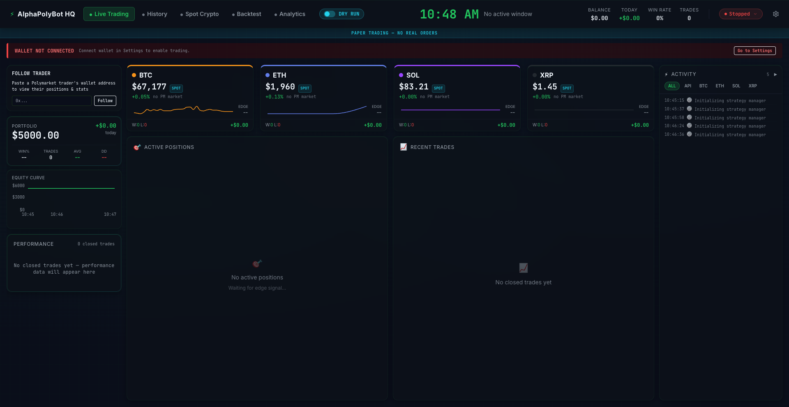
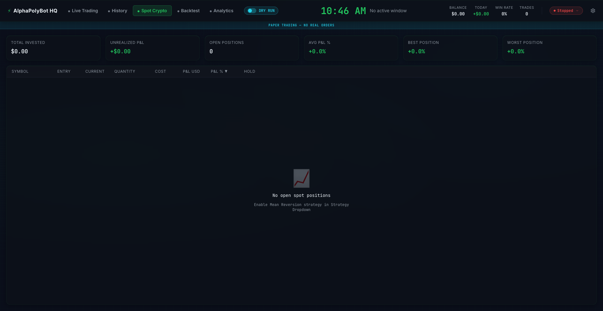
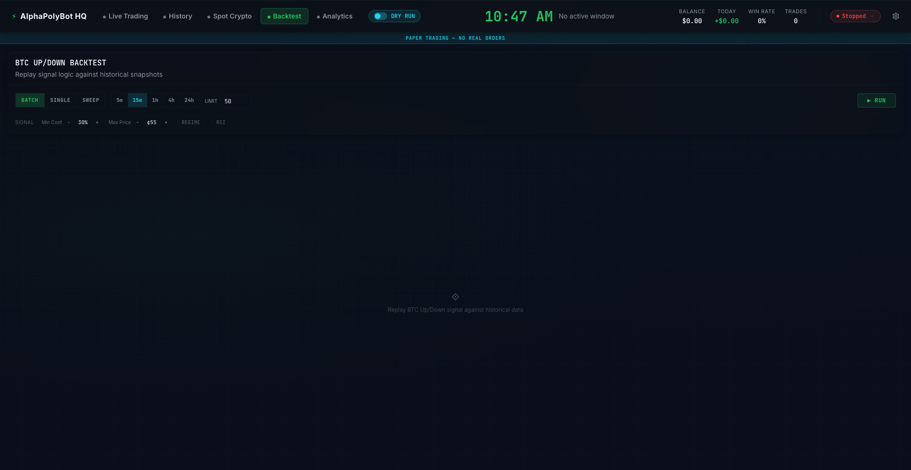
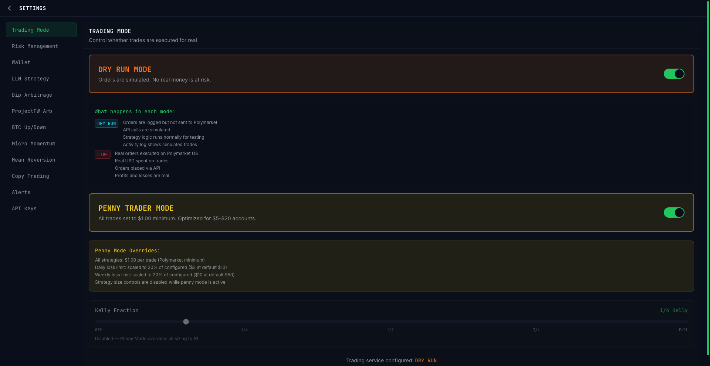

<div align="center">

# `> AlphaPolyBot_`

### Autonomous Polymarket Trading Engine

[](https://github.com/Deegan4/alphapolybot/actions)
[](https://www.typescriptlang.org/)
[](https://reactjs.org/)
[](https://vitejs.dev/)
[](#testing)
[](LICENSE)

<br/>

*A browser-based trading bot running eight independent strategies on [Polymarket](https://polymarket.com) prediction markets — from AI-powered LLM analysis to microstructure momentum, Frank-Wolfe optimized arbitrage, dual-side maker hedging, and whale copy trading.*

<br/>

```
 ╔══════════════════════════════════════════════════════════════╗
 ║  ░▒▓ ALPHA POLY BOT ▓▒░                                    ║
 ║                                                              ║
 ║  strategies: 8 ■■■■■■■■  positions: 3    P&L: +$12.47      ║
 ║  uptime: 4h 23m          risk: NOMINAL   mode: LIVE         ║
 ║                                                              ║
 ║  [LLM] scanning 847 markets...  confidence: 0.72  ████░     ║
 ║  [DIP] watching 12 tokens       last dip: -6.2%   ███░░     ║
 ║  [F-W] 3 arb candidates         spread: 1.8%      ██░░░     ║
 ║  [BTC] 5-factor signal          score: 0.46       ████░     ║
 ║  [MIC] flow toxicity: 0.23      imbalance: +0.31  ███░░     ║
 ║  [MRV] BTC Z-score: -2.14      entry: SHORT       ████░     ║
 ║  [CPY] 3 whales tracked         last copy: 2m ago  ██░░░     ║
 ║  [DSH] YES@0.52 NO@0.51        maker spread: 0.03 ███░░     ║
 ╚══════════════════════════════════════════════════════════════╝
```

<br/>



</div>

---

## Table of Contents

- [Landing Page](#landing-page)
- [Architecture](#architecture)
- [Strategies](#strategies)
- [Risk Infrastructure](#risk-infrastructure)
- [Quick Start](#quick-start)
- [Commands](#commands)
- [Testing](#testing)
- [MCP Server](#mcp-server)
- [Tech Stack](#tech-stack)
- [Project Structure](#project-structure)
- [Deployment](#deployment)
- [Disclaimer](#disclaimer)

## Screenshots

<table>
<tr>
<td width="50%">
<strong>Spot Crypto Trading</strong><br/>
Real-time BTC/ETH/SOL positions with Z-score signals
<br/><br/>

</td>
<td width="50%">
<strong>Backtest Engine</strong><br/>
Historical replay with equity curves and parameter sweeps
<br/><br/>

</td>
</tr>
<tr>
<td colspan="2">
<strong>Settings &amp; Configuration</strong><br/>
Dry run mode, penny trader, wallet management, strategy parameters
<br/><br/>

</td>
</tr>
</table>

## Landing Page

A standalone project landing page lives at [`public/landing/index.html`](public/landing/index.html) — a single self-contained file (no build step, no dependencies) that ships with the app and is served at **`/landing`** on the deployed site.

```bash
npm run dev        # then open http://localhost:4000/landing/
```

It covers the eight strategies, the layered architecture, the risk stack, the test suite breakdown, and quick start — with an animated Matrix rain hero, a live boot-log terminal, and a screenshot lightbox. Content stays fully visible without JavaScript, and all motion respects `prefers-reduced-motion`.

## Architecture

```
┌─────────────────────────────────────────────────────────────────┐
│                        Browser (React 18)                       │
├──────────┬──────────┬──────────┬──────────┬────────────────────┤
│ Trading  │Dashboard │ Activity │ Settings │   Notifications    │
│ Terminal │Portfolio │  + Logs  │ + Wallet │   (Toast + Audio)  │
│          │Backtest  │          │          │                    │
├──────────┴──────────┴──────────┴──────────┴────────────────────┤
│                      Zustand Stores                             │
│        settings (v32) · wallet · notifications · backtest       │
├─────────────────────────────────────────────────────────────────┤
│                     Strategy Manager                            │
│ ┌──────┐ ┌─────┐ ┌──────┐ ┌─────┐ ┌─────┐ ┌─────┐ ┌─────┐ ┌─────┐│
│ │ LLM  │ │ Dip │ │Frank-│ │ BTC │ │Micro│ │Mean │ │Copy │ │Dual ││
│ │Predct│ │ Arb │ │Wolfe │ │Up/Dn│ │Struc│ │Revrt│ │Trade│ │Side ││
│ └──┬───┘ └──┬──┘ └──┬───┘ └──┬──┘ └──┬──┘ └──┬──┘ └──┬──┘ └──┬──┘│
├─────┴─────────┴────────┴────────┴────────┴────────┴────────┴────┤
│                      Trading Service                           │
│ Kelly Sizer · Gas Oracle · Order Book Depth · Trade Logger     │
│ Edge Tracker · Calibration · Rejection Tracker · Market Scanner│
├─────────────────────────────────────────────────────────────────┤
│                      Risk Manager                               │
│ Circuit Breaker · Position Lifecycle · SL/TP · Crash Recovery  │
├───────────┬───────────┬────────────┬───────────────────────────┤
│CLOB Client│Gamma/Data │  Realtime  │     Coinbase Client       │
│(order sign│(markets)  │ Market/User│     (spot crypto)         │
│ + US SDK) │           │ WS + RTDS  │                           │
├───────────┴───────────┴────────────┴───────────────────────────┤
│               Polygon Network (Ethers.js v6)                   │
│        USDC.e · CTF Exchange · NegRisk Adapter                 │
└─────────────────────────────────────────────────────────────────┘
```

## Strategies

| # | Strategy | Signal Source | Edge | Frequency |
|:-:|:---------|:-------------|:-----|:----------|
| 1 | **LLM Prediction** | OpenRouter multi-model analysis with Brier-score calibration tracking | AI identifies mispriced markets | Adaptive (accelerates near close) |
| 2 | **Dip Arbitrage** | WebSocket price monitoring + order book spread scan, GTD orders with ask premium | Buys temporary dips on binary outcomes | 60s market / 30s spread |
| 3 | **Frank-Wolfe Arb** | Bregman projection optimizer on CLOB books with cross-market mutex validation | Exploits ask-sum < $1.00 across outcomes | 15s full scan |
| 4 | **BTC Up/Down** | 5-factor vol-normalized signal (momentum, velocity, time decay, value, flow) with regime detection + RSI filter | Trades crypto direction markets at resolution | Per 15-min window |
| 5 | **Microstructure Momentum** | Bid/ask imbalance, spread volatility, trade flow toxicity via MicrostructureAnalyzer | Exploits informed flow signals | Continuous |
| 6 | **Mean Reversion** | Z-score mean reversion on Coinbase spot crypto (BTC/ETH/SOL) via BinanceWS live feed | Fades extreme Z-score deviations | Continuous |
| 7 | **Copy Trading** | Mirrors trades from tracked Polymarket whale wallets with configurable position sizing | Piggybacks on whale alpha | Event-driven |
| 8 | **Dual-Side Hedge** | Maker-only YES+NO orders with 70/30 directional bias, driven by BTC signal engine + DynamicFeeService EV gate | Captures spread on both sides while maintaining directional exposure | Event-driven (signal-gated) |

## Risk Infrastructure

| Component | Function |
|:----------|:---------|
| **Circuit Breaker** | Daily loss limit ($10), hourly trade cap (20), consecutive failure halt (5) |
| **Position Lifecycle Manager** | SL/TP enforcement via real-time WebSocket, partial exits, time-based exits, IndexedDB crash recovery |
| **Kelly Criterion Sizing** | Drawdown-adjusted fractional Kelly with high-water mark tracking |
| **Gas Oracle** | Skips trades when Polygon gas exceeds 50% of expected profit |
| **Order Book Depth** | Caps order size to available liquidity |
| **Edge Tracker** | Tracks realized vs. predicted edge with exponential decay |
| **Rejection Tracker** | Monitors exchange rejection patterns for early signal degradation |

## Quick Start

```bash
# Clone and install
git clone https://github.com/Deegan4/alphapolybot.git
cd alphapolybot
npm install

# Configure
cp .env.example .env
# Edit .env: add VITE_WALLET_SEED_PHRASE and VITE_OPENROUTER_API_KEY

# Run
npm run dev        # Dev server on :4000
```

### Setup Checklist

1. Create a **dedicated trading wallet** (not your main wallet!)
2. Fund it with **USDC.e + MATIC** on Polygon
3. Get an **OpenRouter API key** from [openrouter.ai/keys](https://openrouter.ai/keys)
4. In the app: **Settings > Wallet > Approve Tokens** (3 contracts)
5. Start in **dry run mode** — verify trades in the Activity tab
6. When confident, disable dry run for live trading

> **Warning**: Use USDC**.e** (bridged), not native USDC. The exchange only sees bridged USDC.e.

## Commands

```bash
npm run dev            # Vite dev server on :4000
npm run dev:strict-csp # Dev with strict CSP (no Fast Refresh)
npm run build          # Production build (Vite 7 + esbuild)
npm test               # 511 tests (Vitest)
npm run test:watch     # Watch mode
npm run lint           # ESLint
npm run preview        # Preview production build
```

## Testing

557 tests across 23 suites covering all critical paths:

| Suite | Tests | Coverage |
|:------|------:|:---------|
| RiskManager | 32 | Circuit breaker, emergency stop, daily limits |
| PositionLifecycleManager | 25 | SL/TP enforcement, partial exits, crash recovery |
| KellySizer | 33 | Fractional Kelly, drawdown adjustment, edge cases |
| FrankWolfeOptimizer | 31 | Bregman projection, convergence, fee handling |
| ProjectFWStrategy | 17 | Scan lifecycle, trade execution, merge retry |
| DipArbStrategy | 21 | Dip detection, spread scan, GTD orders |
| BtcUpDownStrategy | 34 | 5-factor signal, regime detection, RSI filter |
| MeanReversion | 53 | Z-score computation, Coinbase integration, position tracking |
| CopyTrading | 21 | Whale tracking, position mirroring, risk limits |
| CrossMarket | 23 | Event analysis, dependency classification, mutex |
| OpenRouterService | 21 | Budget tracking, model selection, signal fusion |
| EdgeTracker | 24 | Realized vs. predicted edge, decay tracking |
| signalEngine | 57 | Stateless 5-factor signal extraction, 5m profile |
| BacktestRunner | 12 | Historical replay, P&L/Sharpe/drawdown |
| PolyBacktestClient | 15 | API pagination, auth, data transforms |
| ArbitrageProfitFormula | 30 | Profit calculation, fee deduction, edge cases |
| DynamicFeeService | 26 | Quadratic fee curve, trade EV, dual-side EV, Kelly |
| DualSideHedgeStrategy | 14 | Maker YES+NO, bias logic, signal-gated entry |
| secureStorage | 17 | Encryption, key derivation, migration |
| settingsStore | 18 | Persistence, version migration (v32), setter isolation |
| MCP Tools | 12 | Tool execution, parameter validation |
| MCP Rounding | 11 | Tick-size compliance, decimal precision |
| MCP Auth | 8 | API key handling, HMAC signing |

```bash
npm test    # Runs all 557 tests in ~3s
```

## MCP Server

The `mcp-server/` directory contains a standalone [Model Context Protocol](https://modelcontextprotocol.io) server for AI-assisted trading operations. It exposes tools for market analysis, position management, and trade execution to LLM agents.

```bash
cd mcp-server
npm install
npm test       # 31 tests
npm run build
```

## Tech Stack

| Layer | Technology |
|:------|:-----------|
| **Frontend** | React 18, TypeScript 5.3, Tailwind CSS, Framer Motion |
| **Build** | Vite 7 (esbuild transform) |
| **State** | Zustand with persist middleware (v29 schema) |
| **Blockchain** | Ethers.js v6 (Polygon), Polymarket US SDK |
| **Charts** | Recharts |
| **LLM** | OpenRouter (multi-model, budget-bucketed) |
| **Storage** | IndexedDB v4 (6 object stores), Secure encrypted localStorage |
| **Real-time** | WebSocket (market + user + RTDS + BinanceWS) |
| **Crypto Prices** | Coinbase API (HMAC-SHA256), BinanceWS |
| **Testing** | Vitest + jsdom + Testing Library |
| **CI/CD** | GitHub Actions + Netlify |

## Project Structure

```
src/
├── components/
│   ├── charts/         # MatrixLineChart, AreaChart, BarChart, PieChart, Gauge, Sparkline
│   ├── dashboard/      # 22 components: BacktestView, ActivePositions, PerformancePanel,
│   │                   # FollowTraderPanel, SpotCryptoView, DiagnosticsBanner, etc.
│   ├── layout/         # AppLayout, DashboardLayout, SettingsLayout, Header, Sidebar, MatrixRain
│   └── ui/             # 18 Matrix-themed components (Button, Card, Modal, Toast, etc.)
├── hooks/              # useWallet, useBalanceHistory, useCryptoPrices, usePolymarketPrices
├── services/
│   ├── api/            # CLOBClient, GammaClient, DataClient, CoinbaseClient,
│   │                   # PolyBacktestClient, PolymarketUSClient, PriceOracleService
│   ├── llm/            # OpenRouterService (multi-model, budget-bucketed)
│   ├── notifications/  # Toast + Browser + Web Audio
│   ├── realtime/       # RealtimeService, RTDSService, UserChannelService, BinanceWSService
│   ├── storage/        # IndexedDB v4 (6 object stores)
│   ├── strategies/     # 8 strategies + optimizers + cross-market + signal engine
│   │   ├── btcupdown/  # signalEngine, BacktestRunner, HistoricalEnrichment
│   │   └── projectfw/  # FrankWolfeOptimizer, ArbitrageScanner
│   ├── trading/        # TradingService, RiskManager, PLM, KellySizer, GasOracle,
│   │                   # OrderBookDepth, TradeLogger, EdgeTracker, CalibrationTracker,
│   │                   # MicrostructureAnalyzer, ReadinessChecker, RejectionTracker
│   └── wallet/         # Ethers.js wrapper, approvals, balance tracking
├── stores/             # Zustand (settings v32, wallet, notifications, backtest)
├── views/              # TradingTerminal, DashboardView, PortfolioView, ActivityView, SettingsView
├── types/              # API types, wallet types
└── utils/              # secureStorage, cn (tailwind-merge)

mcp-server/             # Standalone MCP server for AI-assisted trading
```

## Deployment

Configured for Netlify with GitHub Actions CI:

```bash
# CI runs on every push/PR to main:
# 1. npm ci
# 2. npm run lint
# 3. npm test (511 tests)
# 4. npm run build
```

Netlify config in `netlify.toml` handles SPA routing and API proxy paths.

## Disclaimer

> **This software is for educational and research purposes only.** Trading on prediction markets involves significant financial risk. The authors are not responsible for any financial losses. Always use a dedicated wallet with funds you can afford to lose. Never trade with money you cannot afford to lose.

---

<div align="center">

Built with TypeScript, React, and too much coffee.

[Report Bug](.github/ISSUE_TEMPLATE/bug_report.md) · [Request Feature](.github/ISSUE_TEMPLATE/feature_request.md)

</div>
