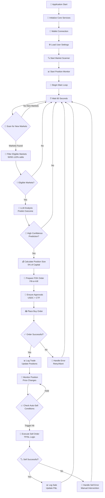
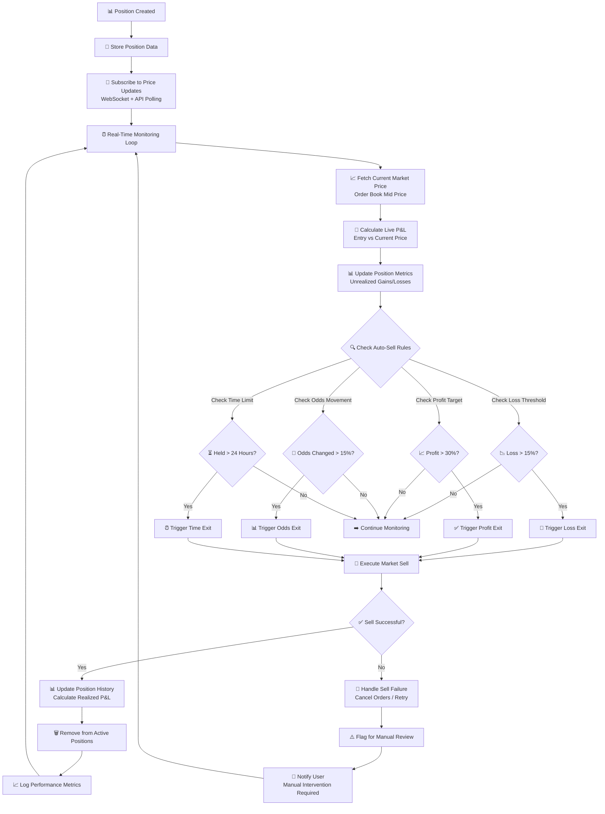
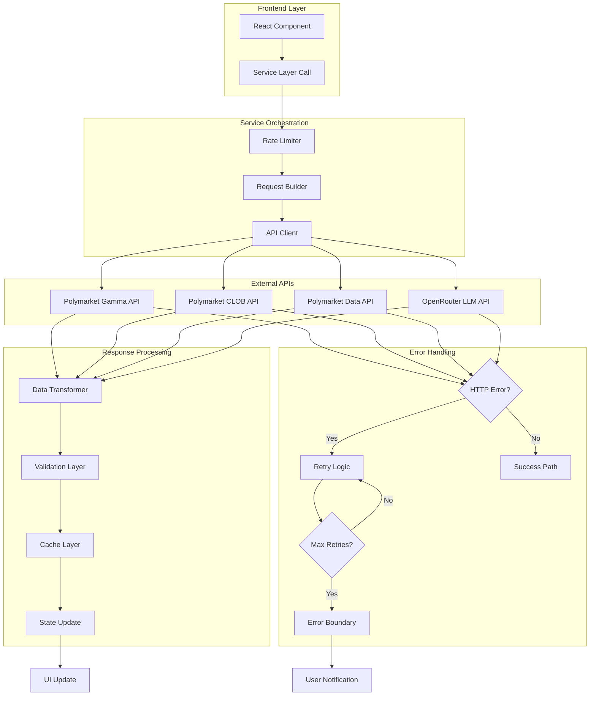
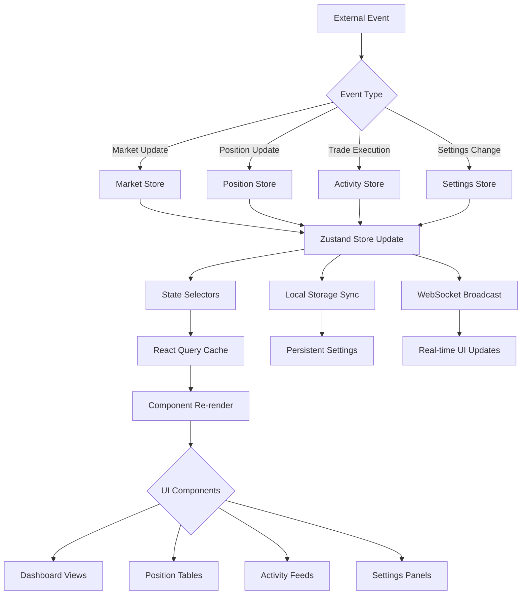
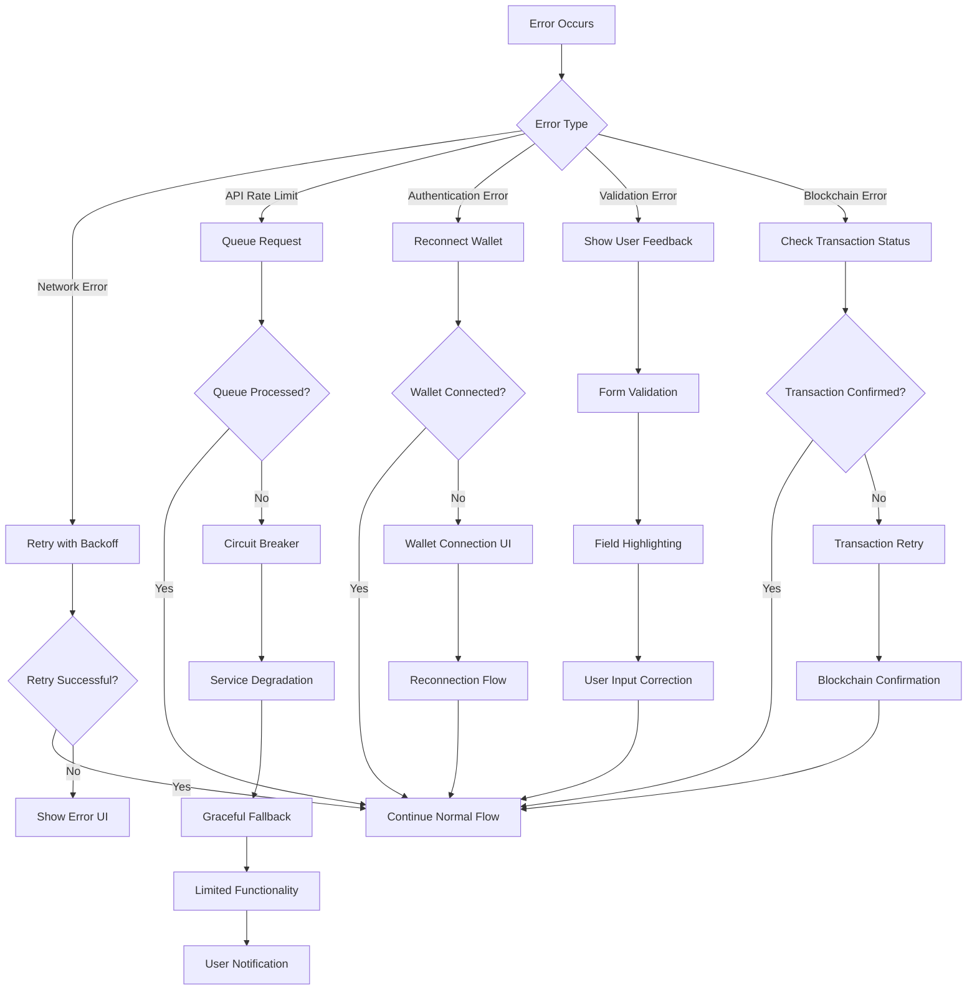
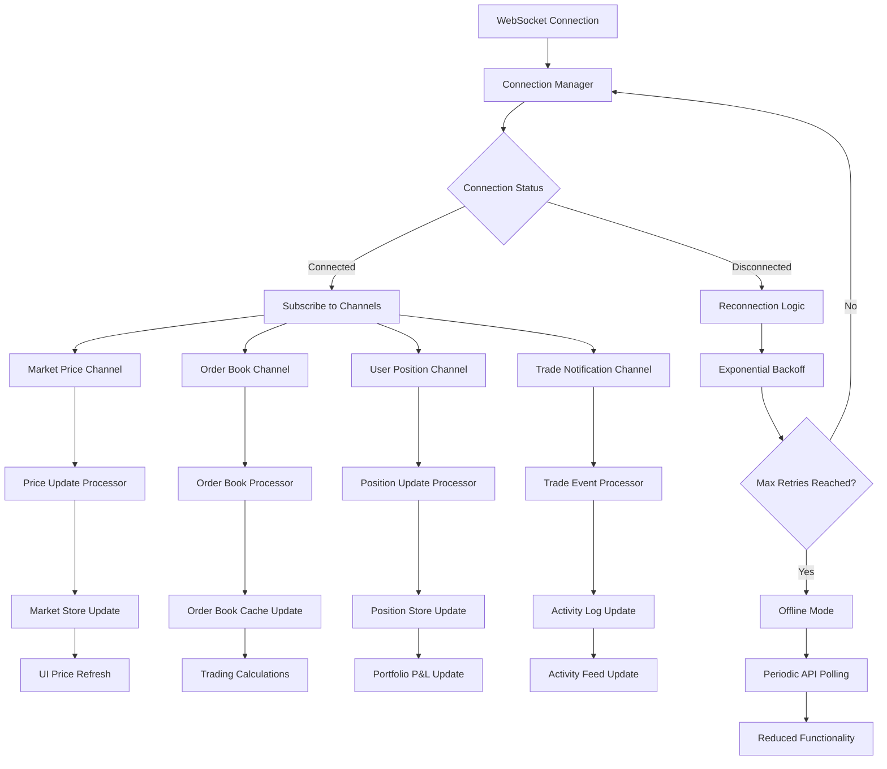
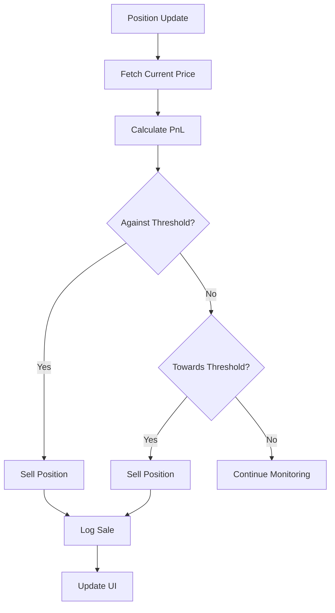

# Polymarket LLM Prediction Bot - Build Plan

## Executive Summary

This comprehensive document outlines the complete architectural design, implementation strategy, and development roadmap for a sophisticated browser-based TypeScript Polymarket trading bot. The system leverages Large Language Models (LLMs) with internet search capabilities to intelligently analyze and trade on newly created prediction markets, specifically targeting opportunities with near 50/50 odds for optimal risk-adjusted returns.

Before you begin, be sure to create your FRESH Polymarket account via THIS link: https://polymarket.com?via=alphastack-eymx

### System Overview

- **Technology Stack**: Modern TypeScript/React application built with Vite, deployed on Netlify
- **Core Innovation**: AI-powered market analysis using OpenRouter API with real-time web search
- **Target Markets**: Newly created Polymarket contracts with balanced odds (±10% from 0.5 probability)
- **Risk Management**: Conservative position sizing (5% of capital) with intelligent auto-exit strategies
- **User Experience**: Immersive Matrix-inspired dark UI with neon green accents and real-time feedback

### Core Value Proposition

1. **Intelligence Automation**: Replaces manual market analysis with AI-driven insights
2. **Multi-Strategy Architecture**: Run multiple trading strategies simultaneously with independent ON/OFF controls
3. **Risk-Adjusted Trading**: Focuses on balanced markets with defined exit strategies
4. **Real-Time Operation**: Continuous monitoring with WebSocket real-time data feeds
5. **User Control**: Manual override capabilities with customizable parameters per strategy
6. **Cost Efficiency**: Browser-based eliminates server costs, LLM calls drive intelligence

### Key Differentiators

- **AI-First Approach**: Every trading decision augmented with LLM analysis and web search
- **Balanced Market Focus**: Targets 45-55% probability markets for consistent opportunities
- **Dynamic Risk Management**: Auto-sell triggers based on both profit targets and adverse odds movement
- **Matrix UI Experience**: Unique visual design that enhances focus during trading operations
- **Browser-Native**: Zero installation, instant access, automatic updates via Netlify deployment

### Trading Strategy Fundamentals

**Strategy 1: LLM Prediction (AI-Powered)**
1. **Market Discovery**: Continuous scanning of Gamma API for newly created markets
2. **Opportunity Filtering**: Strict criteria for market age, liquidity, and odds balance (40-60%)
3. **AI Analysis**: Structured LLM prompts combining market questions with real-time web context
4. **Position Sizing**: Percentage-based allocation (5% of capital, scaled by confidence)
5. **Exit Strategy**: Multi-condition auto-sell (15% loss, 30% profit, odds movement)

**Strategy 2: Dip Arbitrage (Mechanical)**
1. **Market Selection**: 15-minute crypto markets (BTC, ETH, SOL)
2. **Signal Detection**: 30% price drops within 10-second sliding windows
3. **Two-Leg Execution**: Buy dipped side (Leg1), hedge when opposite drops (Leg2)
4. **Position Sizing**: Fixed shares per trade (proven: 25 shares)
5. **Risk-Free Profit**: Lock in guaranteed profit when both legs complete (sumTarget: 0.95 = 5% profit)

**Strategy Manager**: Toggle strategies ON/OFF independently with unified configuration interface

### Technical Architecture Highlights

- **Multi-Strategy Architecture**: BaseStrategy interface with StrategyManager orchestration
- **Service-Oriented Design**: Clean separation between UI, business logic, and data layers
- **Reactive State Management**: Zustand + React Query for optimal real-time performance
- **Robust API Integration**: Comprehensive error handling with proven parameters (maxSlippage: 2%, executionCooldown: 500ms)
- **WebSocket Streaming**: Real-time market data with automatic reconnection logic (critical for dip detection)
- **Multiple Order Types**: FOK (fast arbitrage), FAK (partial fills), GTC (patient limit orders), GTD (time-limited)
- **Auto-Merge Positions**: Automatic CTF token merging for capital efficiency
- **Progressive Enhancement**: Graceful degradation when APIs are unavailable
- **Security First**: Environment-based configuration with encrypted local storage

### Success Metrics

- **Prediction Accuracy**: Target >55% LLM prediction success rate
- **Risk Management**: Maximum drawdown <20% with defined recovery protocols
- **Operational Reliability**: 99.5% uptime with automatic error recovery
- **User Experience**: Sub-second UI response times with real-time updates
- **Cost Efficiency**: <$50/month in LLM API costs for typical usage patterns

---

## Detailed Table of Contents

### 🎯 Executive Summary

- System Overview & Value Proposition
- Core Strategy & Differentiators
- Technical Architecture Highlights
- Success Metrics & KPIs

### 🏗️ 1. Architecture Overview

- High-Level System Architecture
- Component Architecture Breakdown
- Key Design Decisions & Principles
- Technology Integration Points
- Data Flow Patterns
- Scalability Considerations

### ⚡ 2. Technology Stack

- Frontend Framework & Build Tools
- State Management Solutions
- API Integration Libraries
- Development & Quality Tools
- Deployment & Hosting Platform
- Browser Compatibility Requirements

### 🔌 3. API Integration Plan

- Polymarket Ecosystem Overview
- Gamma API (Market Data & Metadata)
- CLOB API (Central Limit Order Book)
- Data API (Positions & Analytics)
- WebSocket Real-Time Streaming
- OpenRouter LLM Integration
- Integration Challenges & Solutions
- Rate Limiting & Error Handling

### 🧩 4. Core Components

- Market Scanner Service
- LLM Prediction Service
- Trading Service (Orders & Execution)
- Position Manager Service
- Wallet Service (Connection & Approvals)
- Activity Logging & Notification System

### 📊 5. Data Flow Diagrams

- Main Trading Loop Flow
- Position Monitoring & Auto-Sell Flow
- API Request/Response Patterns
- State Update Propagation
- Error Recovery Flows
- WebSocket Message Handling

### 🎛️ 6. State Management

- Global Application State Structure
- Zustand Store Architecture
- React Query Integration
- Local Storage Persistence
- State Synchronization Patterns
- Performance Optimization Strategies

### 🎨 7. UI/UX Design System

- Matrix Theme Color Palette
- Typography & Visual Hierarchy
- Component Library Architecture
- Responsive Design Principles
- Animation & Micro-Interaction System
- Accessibility Compliance

### 🔒 8. Security Considerations

- Wallet Security & Private Key Management
- API Authentication & Authorization
- Data Encryption & Secure Storage
- Input Validation & XSS Prevention
- Rate Limiting & Abuse Prevention
- Audit Logging & Compliance

### 🚀 9. Deployment Strategy

- Netlify Configuration & Build Pipeline
- Environment Variable Management
- CI/CD Integration & Automation
- Performance Optimization for Production
- Rollback Procedures & Version Control
- Monitoring & Alerting Setup

### 🧪 10. Testing Strategy

- Unit Testing Framework & Coverage Goals
- Integration Testing Approach
- End-to-End Testing with Cypress
- API Mocking & Test Data Management
- Performance Testing & Load Simulation
- Cross-Browser Testing Strategy

### 📈 11. Monitoring & Logging

- Application Performance Monitoring
- Error Tracking & Alerting
- Trading Activity Analytics
- LLM Usage & Cost Tracking
- User Behavior Analytics
- Log Aggregation & Analysis

### ⚡ 12. Performance Optimization

- React Rendering Optimization
- Bundle Size Optimization
- API Request Optimization
- Memory Management Strategies
- WebSocket Connection Efficiency
- Browser Storage Optimization

### 🛡️ 13. Risk Management

- Position Sizing Algorithms
- Auto-Sell Strategy Configuration
- Daily/Weekly Loss Limits
- Circuit Breaker Implementation
- Emergency Stop Procedures
- Manual Override Capabilities

### 📅 14. Development Phases (10 Weeks)

- **Phase 1 (Weeks 1-2)**: Foundation & Core Infrastructure ✅ COMPLETED
  - ✅ Vite + React + TypeScript project setup
  - ✅ Wallet integration with Ethers.js
  - ✅ API clients (Gamma, CLOB, Data)
  - ✅ Basic Matrix theme and UI components

- **Phase 2 (Weeks 3-4)**: Trading Logic & AI Integration ✅ COMPLETED
  - ✅ Market scanner with eligibility filtering
  - ✅ OpenRouter LLM integration
  - ✅ Trading service with FOK orders
  - ✅ Auto-trading engine and position manager
  - ✅ **BONUS**: Professional UI redesign with sidebar, live chart, and activity feed

- **Phase 3 (Weeks 5-6)**: Multi-Strategy Architecture & Dip Arbitrage ✅ COMPLETED
  - ✅ Strategy Manager with BaseStrategy interface
  - ✅ WebSocket real-time streaming (<1s latency for dip detection)
  - ✅ Dip Arbitrage strategy implementation (proven 86% ROI parameters)
  - ✅ Enhanced execution parameters (FOK/FAK/GTC/GTD, slippage control, auto-merge)
  - ✅ **BONUS**: Complete UI revamp with TradingTerminal 3-column layout
  - 🚧 Unified strategy configuration UI

- **Phase 4 (Weeks 7-8)**: Production Optimization & Polish 🚧 PLANNED
  - 🚧 Performance optimization and monitoring
  - 🚧 Complete responsive design
  - 🚧 Advanced data visualizations
  - 🚧 Notification system
  - 🚧 Mobile optimization

- **Phase 5 (Weeks 9-10)**: Testing, Deployment & Launch 🚧 PLANNED
  - 🚧 Testing suite for critical paths
  - 🚧 Netlify deployment and CI/CD
  - 🚧 Monitoring and analytics
  - 🚧 Production launch preparation
  - 🚧 Documentation and user guides

### 📁 15. Code Structure & Organization

- Detailed File Tree & Directory Structure
- Component Architecture Patterns
- Service Layer Organization
- Type Definitions & Interfaces
- Utility Function Categories
- Asset Management Structure

### ⚙️ 16. Configuration Management

- Environment Variable Strategy
- Dynamic User Settings System
- Feature Flag Implementation
- Configuration Validation
- Settings Persistence & Migration
- Runtime Configuration Updates

### 🚨 17. Error Handling & Recovery

- Global Error Boundary Implementation
- API Error Classification & Handling
- Network Failure Recovery
- Blockchain Transaction Monitoring
- User-Friendly Error Messages
- Graceful Degradation Strategies

### 🔮 18. Future Enhancements

- Advanced AI Features Roadmap
- Multi-Market Support Expansion
- Social Trading Capabilities
- Mobile Application Development
- API & Integration Expansions
- Performance & Scalability Improvements

### 📋 Appendices

- API Reference Documentation
- Code Snippet Library
- Configuration Templates
- **Proven Strategy Configurations** (from production bots)
- Deployment Checklists
- Troubleshooting Guide
- Performance Benchmarks

---

## 🎯 APPENDIX A: Proven Strategy Configurations

### Dip Arbitrage Configuration (86% ROI in 4 Days - PROVEN)

**Source**: Production bot (@catalyst-team/poly-sdk) with verified results

```typescript
export const DIP_ARB_PROVEN_CONFIG = {
  // ===== Position Sizing =====
  shares: 25,                    // Fixed 25 shares per leg
  sumTarget: 0.95,               // Leg2 trigger when Leg1 + Leg2 <= $0.95 (5% profit)
  
  // ===== Signal Detection =====
  slidingWindowMs: 10000,        // 10 second sliding window
  dipThreshold: 0.30,            // 30% price drop triggers Leg1
  windowMinutes: 14,             // Only trade first 14 minutes of 15-min round
  minPricePoints: 3,             // Need 3+ data points before detecting
  
  // ===== Order Execution =====
  orderType: 'FOK',              // Fill-Or-Kill (all or nothing)
  maxSlippage: 0.02,             // 2% max slippage tolerance
  executionCooldown: 500,        // 500ms delay between orders
  splitOrders: 1,                // No order splitting (simplify execution)
  orderIntervalMs: 500,          // N/A when splitOrders = 1
  
  // ===== Risk Management =====
  leg2TimeoutSeconds: 60,        // Stop-loss: exit if Leg2 not filled in 60s
  autoMerge: true,               // CRITICAL: Auto-convert UP+DOWN → USDC
  autoExecute: true,             // Auto-execute when signals detected
  enableSurge: false,            // Disable surge detection (keep simple)
  
  // ===== Market Selection =====
  underlyings: ['ETH', 'BTC', 'SOL', 'XRP'],  // Which crypto markets
  duration: '15m',               // 15-minute markets only
  autoRotate: true,              // Switch to next round automatically
  
  // ===== Debug & Logging =====
  debug: true,                   // Verbose logging for development
};
```

**Key Parameters Explained**:
- **sumTarget: 0.95** = 5% profit target. Lower = more profit but harder to fill Leg2
- **dipThreshold: 0.30** = 30% drop. Higher = fewer but better signals
- **windowMinutes: 14** = Avoid last-minute manipulation, leave time for Leg2
- **leg2TimeoutSeconds: 60** = Exit if opposite side doesn't drop within 60s

**FAILED Configuration** (for reference - do NOT use):
```typescript
// This configuration LOST 50% in 2 days - DO NOT USE
{
  shares: 20,
  sumTarget: 0.6,              // TOO AGGRESSIVE (40% profit target)
  dipThreshold: 0.01,          // TOO SENSITIVE (1% triggers)
  windowMinutes: 15,           // TOO LONG (entire round)
  // Result: Constant false signals, poor Leg2 execution
}
```

### LLM Prediction Configuration (Enhanced)

```typescript
export const LLM_PREDICTION_CONFIG = {
  // ===== Position Sizing =====
  baseSize: 0.05,                // 5% of allocated capital
  confidenceMultiplier: 2.0,     // Scale up to 10% for high confidence
  maxPositionSize: 0.10,         // Never exceed 10% on single trade
  
  // ===== Market Selection =====
  minOdds: 0.40,                 // 40% (wider than before for more opportunities)
  maxOdds: 0.60,                 // 60%
  minLiquidity: 2000,            // $2000 min liquidity (up from $1000)
  minVolume24h: 1000,            // $1000 daily volume
  maxSpread: 0.05,               // 5% max bid-ask spread
  maxCreatedHours: 48,           // Markets up to 48 hours old
  
  // ===== Order Execution =====
  orderType: 'GTC',              // Good-Till-Cancelled (patient limit orders)
  maxSlippage: 0.02,             // 2% max slippage
  executionCooldown: 5000,       // 5s cooldown (more patient than arb)
  orderTimeout: 300000,          // 5 minute timeout for limit orders
  
  // ===== Risk Management =====
  stopLossPercent: 0.15,         // 15% stop loss
  takeProfitPercent: 0.30,       // 30% take profit
  maxOpenPositions: 5,           // Max 5 concurrent positions
  maxCapitalExposure: 0.25,      // Max 25% of capital deployed
  
  // ===== LLM Configuration =====
  model: 'anthropic/claude-3.5-sonnet',
  temperature: 0.3,              // Low temperature for consistent predictions
  maxTokens: 1500,
  minConfidence: 0.60,           // Only trade if LLM is >60% confident
  webSearchEnabled: true,        // Use web search for context
  
  // ===== Excluded Categories =====
  excludedCategories: [
    'Sports',                    // Too random for LLM
    'Crypto Price',              // Use dip arb instead
  ],
};
```

### Execution Parameters (Global - Apply to All Strategies)

```typescript
export const GLOBAL_EXECUTION_CONFIG = {
  // ===== Rate Limiting (Critical to avoid bans) =====
  rateLimits: {
    ordersPerMinute: 10,
    ordersPerHour: 50,
    apiCallsPerMinute: 60,
  },
  
  // ===== Retry Logic =====
  maxRetries: 3,
  retryDelay: 1000,              // 1s initial delay
  retryDelayMultiplier: 2,       // Exponential backoff
  retryableErrors: [429, 500, 502, 503, 504],
  
  // ===== Timeouts =====
  apiTimeout: 10000,             // 10s for API calls
  websocketPingInterval: 5000,   // 5s WebSocket keepalive
  websocketReconnectDelay: 1000, // 1s initial reconnect delay
  
  // ===== Capital Allocation (Multi-Strategy) =====
  strategyAllocations: {
    dipArbitrage: 0.30,          // 30% to mechanical strategy
    llmPrediction: 0.50,         // 50% to AI strategy
    reserve: 0.20,               // 20% kept liquid for opportunities
  },
};
```

---

---

## 📊 Current Implementation Status (Video 2 Complete)

### ✅ Completed Features

**Core Infrastructure (Video 1)**
- ✅ Vite + React + TypeScript project with Tailwind CSS
- ✅ Ethers.js wallet integration with seed phrase support
- ✅ Polygon network configuration with USDC balance tracking
- ✅ Token approval system (USDC + CTF)
- ✅ API clients: Gamma (markets), CLOB (trading), Data (positions)
- ✅ Base API client with rate limiting and error handling
- ✅ Secure storage for wallet data

**Trading System (Video 2)**
- ✅ Market scanner with eligibility filtering (50/50 odds, liquidity checks)
- ✅ LLM prediction service (OpenRouter + Claude-3.5-Sonnet)
- ✅ Trading service with FOK order execution
- ✅ Position manager with P&L tracking and auto-sell logic
- ✅ Auto-trading engine (scan → analyze → trade loop)
- ✅ Activity logger for complete event tracking
- ✅ Risk management (position sizing, loss limits, daily caps)

**UI/UX (Video 2 - Enhanced)**
- ✅ Professional Matrix theme with cosmic background
- ✅ Sidebar navigation with icon-based menu
- ✅ Header with system status indicators
- ✅ Live SVG price chart component
- ✅ Dashboard with metrics, activity feed, and controls
- ✅ Markets view with LLM analysis display
- ✅ Wallet connection interface with approval management
- ✅ Complete component library (MatrixCard, MatrixButton, MatrixInput, MatrixModal, MatrixLoading)
- ✅ Matrix rain animation and glow effects

### ✅ Completed Features (Video 3) | 🚧 Planned Features (Video 4)

**Advanced Trading (Video 3)** ✅ COMPLETED
- ✅ WebSocket real-time market data streaming (<1s latency)
- ✅ Multi-strategy architecture with BaseStrategy pattern
- ✅ Dip arbitrage strategy (15-min crypto markets, 86% ROI parameters)
- ✅ Enhanced order execution (FOK/FAK/GTC/GTD, slippage control, auto-merge)
- ✅ Complete UI revamp with TradingTerminal 3-column layout
- ✅ Strategy management dashboard with real-time stats
- ✅ Professional portfolio management with position analytics

**Production Ready (Video 4)**
- 🚧 Comprehensive testing suite
- 🚧 Netlify deployment with CI/CD
- 🚧 Monitoring and error tracking
- 🚧 Complete documentation

---

## 🏗️ 1. Architecture Overview

### System Architecture Principles

The Polymarket LLM Bot follows a **layered, service-oriented architecture** designed specifically for browser-based trading applications. The system is built around three core principles:

1. **Decentralized Execution**: All trading logic runs client-side, eliminating server dependencies
2. **AI-Augmented Decision Making**: Every trade decision incorporates LLM analysis with real-time context
3. **Reactive Real-Time Updates**: Sub-second response times for market changes and position updates

### High-Level System Architecture

```
┌─────────────────────────────────────────────────────────────┐
│                    BROWSER APPLICATION                      │
│  ┌─────────────────────────────────────────────────────┐    │
│  │                 REACT UI LAYER                     │    │
│  │  ┌─────────────┬─────────────┬─────────────────┐   │    │
│  │  │  Dashboard  │  Activity   │   Settings      │   │    │
│  │  │             │   Feed      │   Panel         │   │    │
│  │  └─────────────┴─────────────┴─────────────────┘   │    │
│  └─────────────────────────────────────────────────────┘    │
│  ┌─────────────────────────────────────────────────────┐    │
│  │              SERVICE ORCHESTRATION LAYER           │    │
│  │  ┌─────────────┬─────────────┬─────────────────┐   │    │
│  │  │ Market      │  Trading    │   Position      │   │    │
│  │  │ Scanner     │  Service    │   Manager       │   │    │
│  │  └─────────────┴─────────────┴─────────────────┘   │    │
│  └─────────────────────────────────────────────────────┘    │
│  ┌─────────────────────────────────────────────────────┐    │
│  │                 EXTERNAL INTEGRATIONS               │    │
│  │  ┌─────────────┬─────────────┬─────────────────┐   │    │
│  │  │ Polymarket  │ OpenRouter  │   WebSocket     │   │    │
│  │  │ APIs        │ LLM API     │   Streams       │   │    │
│  │  └─────────────┴─────────────┴─────────────────┘   │    │
│  └─────────────────────────────────────────────────────┘    │
└─────────────────────────────────────────────────────────────┘
         │                        │                        │
         ▼                        ▼                        ▼
┌─────────────────┐    ┌─────────────────┐    ┌─────────────────┐
│  Local Storage  │    │  Browser APIs   │    │  Blockchain     │
│  (Settings)     │    │  (Timers, WS)   │    │  (Polygon)      │
└─────────────────┘    └─────────────────┘    └─────────────────┘
```

### Component Architecture Breakdown

```
Browser Application
├── 🎨 Presentation Layer (React Components)
│   ├── Core Views (components/dashboard/)
│   │   ├── StrategyConfigView.tsx  # ✅ Strategy management dashboard with live stats
│   │   ├── MarketsView.tsx         # ✅ Market scanning display with LLM analysis
│   │   └── DashboardView.tsx       # 🗑️ Removed - replaced by TradingTerminal
│   ├── Terminal Views (components/terminal/)
│   │   ├── TradingTerminal.tsx     # ✅ Unified 3-column trading interface
│   │   ├── MainChart.tsx           # ✅ Live price chart with market selection
│   │   ├── parts/MarketList.tsx    # ✅ Real-time market scanner component
│   │   ├── parts/StrategyControl.tsx # ✅ Strategy execution & parameter controls
│   │   └── parts/PortfolioPanel.tsx  # ✅ Position tracking & P&L display
│   ├── Portfolio Views (components/portfolio/)
│   │   └── PortfolioView.tsx       # ✅ Portfolio management with position table
│   ├── Activity Views (components/activity/)
│   │   └── ActivityView.tsx        # ✅ System logs console with filtering
│   ├── Settings Views (components/settings/)
│   │   └── SettingsView.tsx        # ✅ Configuration panel for all settings
│   ├── UI Components (components/ui/)
│   │   ├── Button.tsx              # ✅ MatrixButton with variants (solid, outline, primary, etc.)
│   │   ├── Card.tsx                # ✅ MatrixCard with variants (default, bordered, glow, glass)
│   │   ├── Input.tsx               # ✅ MatrixInput with Matrix theme styling
│   │   ├── Loading.tsx             # ✅ MatrixLoading spinner component
│   │   ├── Modal.tsx               # ✅ MatrixModal dialog component
│   │   └── index.ts                # ✅ Barrel export file
│   ├── Layout Components (components/layout/)
│   │   ├── AppLayout.tsx           # ✅ Main app layout with sidebar and header
│   │   ├── Sidebar.tsx             # ✅ Icon-based navigation sidebar (replaces Navigation.tsx)
│   │   ├── Header.tsx              # ✅ Status indicators and system info
│   │   ├── MatrixContainer.tsx     # ✅ Cosmic background with matrix rain effect
│   │   └── index.ts                # ✅ Barrel export file
│   ├── Charts (components/charts/)
│   │   ├── PriceChart.tsx          # ✅ Live SVG-based price chart with YES/NO lines
│   │   └── index.ts                # ✅ Barrel export file
│   ├── Forms (components/forms/)   # 📁 Empty folder (reserved for Video 3)
│   └── WalletConnect.tsx           # ✅ Wallet connection, balance, and token approvals
│
├── 🔧 Service Layer (Business Logic)
│   ├── Strategy Management (services/strategies/)
│   │   ├── BaseStrategy.ts         # ✅ Abstract base class for all strategies (Video 3)
│   │   ├── StrategyManager.ts      # ✅ Orchestrates multiple strategies with ON/OFF toggles (Video 3)
│   │   ├── LLMPredictionStrategy.ts # ✅ Your existing auto-trading refactored as strategy (Video 3)
│   │   ├── DipArbStrategy.ts       # ✅ 15-min crypto dip arbitrage strategy (Video 3)
│   │   ├── index.ts                # ✅ Barrel export file (Video 3)
│   │   └── DipDetector.ts          # ✅ Sliding window dip detection service (Video 3)
│   ├── Trading Services (services/trading/)
│   │   ├── MarketScanner.ts        # ✅ Market discovery, filtering, and scoring
│   │   ├── TradingService.ts       # ✅ FOK order execution and management
│   │   ├── PositionManager.ts      # ✅ Position tracking, P&L, and auto-sell logic
│   │   ├── AutoTradingEngine.ts    # ✅ Complete scan → analyze → trade loop
│   │   └── ActivityLogger.ts       # ✅ Activity logging and event tracking
│   ├── Real-Time Services (services/realtime/)
│   │   └── RealtimeService.ts      # ✅ WebSocket price feeds wrapper (Video 3)
│   ├── AI Services (services/llm/)
│   │   └── OpenRouterService.ts    # ✅ LLM API integration with prompt engineering
│   ├── Wallet Services (services/wallet/)
│   │   └── WalletService.ts        # ✅ Wallet connection, balance, token approvals, auto-merge
│   └── API Clients (services/api/)
│       ├── BaseApiClient.ts        # ✅ Base client with rate limiting and error handling
│       ├── GammaClient.ts          # ✅ Market metadata API
│       ├── CLOBClient.ts           # ✅ Order book & trading API
│       ├── DataClient.ts           # ✅ Position data API
│       └── index.ts                # ✅ Barrel export file
│
├── 📊 State Management Layer (stores/)
│   └── walletStore.ts              # ✅ Wallet state with Zustand
│   # Note: Most state is managed directly in services with callback patterns
│   # Additional stores (marketStore, positionStore, etc.) planned for Video 3
│
├── 🌐 Data Access Layer
│   # Note: API clients handle data access directly (see services/api/ above)
│   # Data transformers and caching are integrated into service layer
│
└── 🛠️ Infrastructure & Utilities
    ├── Core Utilities (utils/)
    │   ├── cn.ts                   # ✅ Tailwind class merging utility
    │   └── secureStorage.ts        # ✅ Encrypted local storage
    ├── Type Definitions (types/)
    │   ├── api.ts                  # ✅ API response types (Market, Position, Order, etc.)
    │   ├── wallet.ts               # ✅ Wallet & blockchain types
    │   └── vite-env.d.ts           # ✅ Vite environment type definitions
    ├── Hooks (hooks/)
    │   └── useWallet.ts            # ✅ Wallet connection hook
    ├── Constants (constants/)      # 📁 Empty folder (reserved for future use)
    └── Assets (assets/)
        ├── icons/                  # 📁 Custom icons folder
        ├── fonts/                  # 📁 Custom fonts folder
        └── react.svg               # ✅ React logo
```

### Key Design Decisions & Architectural Principles

#### 1. **Browser-First Architecture**

- **Rationale**: Eliminates server infrastructure costs and complexity
- **Benefits**: Instant deployment, zero maintenance overhead, automatic scaling
- **Constraints**: Limited to browser APIs, no persistent background processing
- **Mitigations**: Service workers for background tasks, local storage for persistence

#### 2. **Service-Oriented Design Pattern**

- **Rationale**: Clean separation of concerns with testable, reusable components
- **Benefits**: Modularity, testability, maintainability, parallel development
- **Implementation**: Each service has single responsibility, dependency injection
- **Communication**: Event-driven architecture with typed interfaces

#### 3. **Reactive State Management**

- **Rationale**: Real-time trading requires immediate UI updates and state synchronization
- **Benefits**: Predictable state updates, optimized re-renders, developer experience
- **Implementation**: Zustand for global state, React Query for server state
- **Performance**: Selective subscriptions, memoized selectors, optimistic updates

#### 4. **AI-First Decision Framework**

- **Rationale**: LLM analysis provides edge over traditional quantitative strategies
- **Benefits**: Contextual understanding, real-time web information integration
- **Implementation**: Structured prompts, confidence scoring, fallback mechanisms
- **Optimization**: Response caching, cost monitoring, accuracy tracking

#### 5. **Progressive Enhancement & Resilience**

- **Rationale**: Trading systems must be robust against API failures and network issues
- **Benefits**: Graceful degradation, user trust, continuous operation
- **Implementation**: Circuit breakers, retry logic, offline capabilities
- **Monitoring**: Comprehensive error tracking and recovery metrics

#### 6. **Security-by-Design Approach**

- **Rationale**: Handling real money requires uncompromising security practices
- **Benefits**: User protection, regulatory compliance, platform trust
- **Implementation**: Environment-based config, encrypted storage, audit logging
- **Validation**: Input sanitization, rate limiting, permission checks

### Technology Integration Points

#### External API Dependencies

- **Polymarket Gamma API**: Market discovery, metadata, and basic data
- **Polymarket CLOB API**: Order placement, execution, and order book data
- **Polymarket Data API**: Position tracking, trade history, and analytics
- **OpenRouter API**: LLM analysis with web search capabilities
- **Web3 Providers**: Wallet connection and blockchain interaction

#### Browser API Utilization

- **WebSocket API**: Real-time market data streaming
- **Local Storage API**: Settings and state persistence
- **Service Worker API**: Background processing and offline capabilities
- **Page Visibility API**: Efficient resource management
- **Notification API**: Trading alerts and system notifications

### Data Flow Patterns

#### Unidirectional Data Flow

```
User Interaction → UI Component → Service Call → API Request → State Update → UI Re-render
```

#### Real-Time Data Streaming

```
WebSocket Message → Data Transformer → State Update → UI Component → Visual Feedback
```

#### Error Recovery Flow

```
Error Detection → Error Classification → Recovery Strategy → State Update → User Notification
```

### Scalability Considerations

#### Current Limitations

- Single-user architecture (browser-based)
- LLM API rate limits and costs
- Browser storage constraints
- No persistent background processing

#### Future Scaling Vectors

- Multi-tab synchronization via SharedWorker
- Service worker for cross-session persistence
- IndexedDB for larger datasets
- Progressive Web App capabilities
- Multi-wallet support

#### Performance Benchmarks

- **Initial Load**: <2 seconds
- **Market Scan**: <500ms
- **LLM Analysis**: <3 seconds
- **Order Execution**: <1 second
- **UI Updates**: <100ms
- **Memory Usage**: <50MB

This architecture provides a solid foundation for a sophisticated trading bot while maintaining the simplicity and reliability required for financial applications.

---

## ⚡ 2. Technology Stack

### Core Frontend Framework

#### React Ecosystem

```json
{
  "react": "^18.2.0",
  "react-dom": "^18.2.0",
  "typescript": "^5.2.0",
  "@types/react": "^18.2.0",
  "@types/react-dom": "^18.2.0"
}
```

- **React 18+**: Latest features including concurrent rendering, automatic batching, and Suspense improvements
- **TypeScript 5.2+**: Strict type checking, advanced type inference, and performance optimizations
- **JSX Transform**: Modern JSX without React imports for cleaner component code

#### Build Tools & Development Server

```json
{
  "vite": "^4.4.0",
  "@vitejs/plugin-react": "^4.1.0",
  "rollup": "^3.29.0"
}
```

- **Vite 4.4+**: Lightning-fast development server with HMR, optimized production builds
- **Rollup Integration**: Advanced tree-shaking and code splitting capabilities
- **Plugin Architecture**: Extensible build pipeline for custom optimizations

#### Routing & Navigation

```json
{
  "react-router-dom": "^6.16.0",
  "@types/react-router-dom": "^5.3.0"
}
```

- **React Router 6.16+**: Declarative routing with nested routes and data loading
- **History API**: Browser history management with back/forward support
- **Protected Routes**: Authentication-based route guarding

### Styling & UI Framework

#### Tailwind CSS with Custom Extensions

```json
{
  "tailwindcss": "^3.3.0",
  "autoprefixer": "^10.4.0",
  "postcss": "^8.4.0",
  "tailwindcss-animate": "^1.0.0"
}
```

- **Tailwind CSS 3.3+**: Utility-first CSS framework with JIT compilation
- **Custom Design System**: Matrix theme with neon green color palette
- **Animation Library**: Smooth transitions and micro-interactions
- **Dark Mode Native**: CSS custom properties for theme switching

#### UI Component Architecture

- **Custom Component Library**: Matrix-themed components built on Tailwind
- **Compound Components**: Flexible, reusable component patterns
- **CSS-in-JS**: Styled-components for dynamic theming
- **Icon System**: Custom SVG icons with theme-aware coloring

### State Management Solutions

#### Global State Management

```json
{
  "zustand": "^4.4.0",
  "@types/zustand": "^4.4.0"
}
```

- **Zustand 4.4+**: Lightweight, TypeScript-first state management
- **Immer Integration**: Immutable state updates with mutation syntax
- **Middleware Support**: Logging, persistence, and debugging capabilities
- **Store Composition**: Modular store architecture with selectors

#### Server State Management

```json
{
  "@tanstack/react-query": "^4.36.0",
  "@tanstack/react-query-devtools": "^4.36.0"
}
```

- **React Query 4.36+**: Powerful data synchronization for server state
- **Caching Strategy**: Intelligent caching with background refetching
- **Optimistic Updates**: Immediate UI feedback with rollback capabilities
- **Error Handling**: Retry logic and error boundary integration

#### Local Storage & Persistence

```json
{
  "idb": "^7.1.0",
  "@types/idb": "^1.0.0"
}
```

- **IndexedDB API**: Advanced browser storage for large datasets
- **Encryption**: Secure storage for sensitive configuration data
- **Migration System**: Versioned schema updates for stored data
- **Offline Support**: Service worker integration for offline functionality

### API Integration Libraries

#### HTTP Client & REST APIs

```json
{
  "axios": "^1.5.0",
  "axios-retry": "^3.8.0"
}
```

- **Axios 1.5+**: HTTP client with interceptors and request/response transformation
- **Retry Logic**: Exponential backoff for failed requests
- **Request Cancellation**: AbortController integration for cleanup
- **Response Caching**: Built-in caching with invalidation strategies

#### WebSocket Communication

```json
{
  "reconnecting-websocket": "^4.4.0",
  "@types/reconnecting-websocket": "^1.0.0"
}
```

- **Reconnecting WebSocket**: Automatic reconnection with exponential backoff
- **Heartbeat Monitoring**: Connection health checks and timeout handling
- **Message Queuing**: Offline message buffering and replay
- **Type Safety**: TypeScript interfaces for WebSocket messages

#### Blockchain Integration

```json
{
  "ethers": "^6.7.0",
  "@ethersproject/providers": "^5.7.0",
  "@ethersproject/contracts": "^5.7.0"
}
```

- **Ethers.js 6.7+**: Modern Ethereum library with TypeScript support
- **Multi-Provider Support**: Automatic provider failover and load balancing
- **Contract Abstraction**: Type-safe contract interactions
- **Gas Optimization**: Dynamic gas pricing and transaction optimization

#### LLM API Integration

```json
{
  "openai": "^4.16.0",
  "@types/openai": "^1.0.0"
}
```

- **OpenRouter Compatibility**: Universal LLM API client
- **Streaming Support**: Real-time response streaming for better UX
- **Cost Tracking**: Request/response logging with cost calculation
- **Model Fallback**: Automatic fallback to alternative models

### Development & Quality Tools

#### Code Quality & Linting

```json
{
  "eslint": "^8.50.0",
  "@typescript-eslint/eslint-plugin": "^6.7.0",
  "@typescript-eslint/parser": "^6.7.0",
  "eslint-plugin-react": "^7.33.0",
  "eslint-plugin-react-hooks": "^4.6.0",
  "prettier": "^3.0.0",
  "eslint-config-prettier": "^9.0.0"
}
```

- **ESLint 8.50+**: Comprehensive JavaScript/TypeScript linting
- **TypeScript ESLint**: Type-aware linting rules and error detection
- **React ESLint**: React-specific rules and hooks validation
- **Prettier Integration**: Automated code formatting and consistency

#### Testing Framework

```json
{
  "vitest": "^0.34.0",
  "@testing-library/react": "^14.0.0",
  "@testing-library/jest-dom": "^6.1.0",
  "@testing-library/user-event": "^14.5.0",
  "jsdom": "^22.1.0",
  "msw": "^1.3.0"
}
```

- **Vitest 0.34+**: Fast, TypeScript-native testing framework
- **Testing Library**: User-centric testing utilities
- **MSW (Mock Service Worker)**: API mocking and testing utilities
- **Coverage Reporting**: Detailed test coverage analysis

#### Development Experience

```json
{
  "husky": "^8.0.0",
  "lint-staged": "^14.0.0",
  "commitizen": "^4.3.0",
  "cz-conventional-changelog": "^3.3.0"
}
```

- **Git Hooks**: Pre-commit linting and testing automation
- **Conventional Commits**: Standardized commit message format
- **Development Scripts**: Automated build, test, and deployment scripts

### Deployment & Hosting Platform

#### Netlify Platform

```json
{
  "netlify-cli": "^16.0.0",
  "@netlify/functions": "^2.0.0"
}
```

- **Netlify CLI 16+**: Local development and deployment tooling
- **Edge Functions**: Serverless functions for API proxying (if needed)
- **Build Hooks**: Automated rebuilds on content updates
- **Analytics Integration**: Performance monitoring and user analytics

#### Environment Management

- **Environment Variables**: Secure configuration management
- **Build Contexts**: Different configurations for staging/production
- **Asset Optimization**: Automatic image optimization and CDN delivery
- **Security Headers**: Automatic security headers and HTTPS enforcement

### Browser Compatibility Requirements

#### Supported Browsers

- **Chrome 100+**: Primary development and testing target
- **Firefox 100+**: Full feature support with fallbacks
- **Safari 15+**: iOS Safari and macOS Safari support
- **Edge 100+**: Chromium-based Edge support

#### Required Browser APIs

- **ES2022 Features**: Modern JavaScript features and syntax
- **WebSocket API**: Real-time communication support
- **Local Storage API**: Client-side data persistence
- **Service Worker API**: Background processing and offline support
- **Intersection Observer**: Performance optimizations and lazy loading
- **Resize Observer**: Responsive design and layout adjustments

#### Progressive Enhancement Strategy

- **Core Functionality**: Works in all modern browsers
- **Enhanced Features**: Advanced features for capable browsers
- **Graceful Degradation**: Fallbacks for older browser versions
- **Feature Detection**: Runtime capability checking and conditional loading

### Performance Budgets

#### Bundle Size Limits

- **Initial Bundle**: <500KB gzipped
- **Vendor Chunk**: <300KB gzipped
- **Runtime Chunk**: <50KB gzipped
- **Lazy Loaded Chunks**: <100KB each

#### Runtime Performance

- **First Contentful Paint**: <1.5 seconds
- **Largest Contentful Paint**: <2.5 seconds
- **First Input Delay**: <100 milliseconds
- **Cumulative Layout Shift**: <0.1

#### Memory Usage

- **Initial Heap**: <50MB
- **Peak Usage**: <100MB
- **Memory Leaks**: Zero acceptable leaks
- **Garbage Collection**: Efficient cleanup cycles

This technology stack provides a robust, scalable foundation for a high-performance trading application while maintaining excellent developer experience and user satisfaction.

---

## 🔌 3. API Integration Plan

### Polymarket API Ecosystem Architecture

Polymarket operates a sophisticated multi-API architecture designed for high-frequency trading and real-time market data. The system consists of four primary API services, each optimized for specific use cases while maintaining data consistency across the platform.

### Core API Services Overview

#### 🌐 Gamma API (Market Discovery & Metadata)

**Primary Endpoint**: `https://gamma-api.polymarket.com`
**Purpose**: Comprehensive market data, discovery, and metadata aggregation
**Architecture**: RESTful API with GraphQL-like filtering capabilities
**Rate Limits**: 100 requests/minute, 1000 requests/hour per IP

##### Key Endpoints & Data Structures

**Market Discovery & Listing**

```typescript
GET /markets
Query Parameters:
  - active: boolean (default: true)
  - closed: boolean (default: false)
  - limit: number (max: 100)
  - sort: 'volume24hr' | 'createdAt' | 'liquidity'
  - order: 'asc' | 'desc'
  - cursor: string (for pagination)

Response Structure:
{
  markets: Array<{
    id: string
    question: string
    description: string
    outcomes: string[]
    clobTokenIds: string[]
    active: boolean
    closed: boolean
    endDate: string
    createdAt: string
    volume: number
    liquidity: number
    outcomePrices: number[]
    groupItemTitle?: string
    markets?: Array<{...}> // For market groups
  }>
}
```

**Individual Market Details**

```typescript
GET /markets/{market_id}

Response Structure:
{
  id: string
  question: string
  description: string
  resolutionSource?: string
  outcomes: string[]
  clobTokenIds: string[]
  outcomePrices: number[]
  volume: number
  liquidity: number
  active: boolean
  closed: boolean
  endDate: string
  createdAt: string
  updatedAt: string
  // Additional metadata...
}
```

**Event & Category Browsing**

```typescript
GET /events?active=true&limit=50

Response Structure:
{
  events: Array<{
    id: string
    title: string
    slug: string
    description: string
    active: boolean
    createdAt: string
    markets: Array<{...}>
    categories: Array<{
      id: string
      name: string
      slug: string
    }>
  }>
}
```

**Advanced Search**

```typescript
GET /search?q={query}&limit=20

Response Structure:
{
  markets: Array<{...}>,
  events: Array<{...}>,
  categories: Array<{...}>
}
```

#### 🎯 CLOB API (Central Limit Order Book - Trading Engine)

**Primary Endpoint**: `https://clob.polymarket.com`
**Purpose**: High-performance order execution, market making, and order book management
**Architecture**: Hybrid centralized/decentralized order book with on-chain settlement
**Rate Limits**: 50 orders/minute, 500 orders/hour per wallet
**Authentication**: API key + signature-based authentication

##### Core Trading Endpoints

**Order Placement (Fill-or-Kill)**

```typescript
POST /order
Authentication: Bearer token + signature
Request Body:
{
  token_id: string,        // ERC1155 token ID
  price: number,          // Price in cents (0.01 = 1%)
  size: number,           // Shares to buy/sell
  side: "BUY" | "SELL",   // Order side
  type: "FOK",           // Fill-or-Kill only
  condition_id?: string,  // For new markets
  signature: string       // EIP-712 signature
}

Response Structure:
{
  success: boolean,
  order_id?: string,
  transaction_hash?: string,
  error?: string
}
```

**Order Management**

```typescript
GET /orders?status=OPEN&limit=50
// Returns user's open orders

DELETE /orders/{order_id}
// Cancels specific order

GET /orders/{order_id}
// Get order details and status
```

**Order Book Data**

```typescript
GET /markets/{market_id}/orderbook

Response Structure:
{
  market_id: string,
  bids: Array<{
    price: number,
    size: number,
    timestamp: number
  }>,
  asks: Array<{
    price: number,
    size: number,
    timestamp: number
  }>,
  last_update: number
}
```

**Trade History**

```typescript
GET /trades?market_id={id}&limit=100

Response Structure:
{
  trades: Array<{
    id: string,
    market_id: string,
    token_id: string,
    price: number,
    size: number,
    side: "BUY" | "SELL",
    timestamp: number,
    transaction_hash: string
  }>
}
```

#### 📊 Data API (Positions & Analytics)

**Primary Endpoint**: `https://data-api.polymarket.com`
**Purpose**: User position tracking, P&L calculation, and trading analytics
**Architecture**: Read-optimized data warehouse with real-time updates
**Rate Limits**: 200 requests/minute per wallet
**Authentication**: Wallet signature verification

##### Position Tracking Endpoints

**Current Positions**

```typescript
GET /positions?user={wallet_address}

Response Structure:
{
  positions: Array<{
    asset: string,           // Token ID
    conditionId: string,     // Market ID
    title: string,           // Market question
    size: number,            // Shares held
    avgPrice: number,        // Average entry price
    curPrice?: number,       // Current market price
    cashPnl: number,         // Dollar P&L
    percentPnl: number,      // Percentage P&L
    outcomeIndex: number,    // 0 or 1 for binary markets
    lastUpdated: string
  }>
}
```

**Trade History**

```typescript
GET /trades?user={wallet_address}&limit=100&offset=0

Response Structure:
{
  trades: Array<{
    id: string,
    marketId: string,
    tokenId: string,
    side: "BUY" | "SELL",
    size: number,
    price: number,
    fee: number,
    timestamp: string,
    transactionHash: string
  }>
}
```

**Portfolio Analytics**

```typescript
GET /portfolio?user={wallet_address}&period=24h

Response Structure:
{
  totalValue: number,
  totalPnl: number,
  totalPnlPercent: number,
  dailyPnl: number,
  weeklyPnl: number,
  positions: number,
  activeMarkets: number,
  winRate: number,
  avgTradeSize: number
}
```

#### 🔗 WebSocket API (Real-Time Data Streaming)

**Primary Endpoint**: `wss://ws.polymarket.com`
**Purpose**: Live market data, order book updates, and trade notifications
**Architecture**: Event-driven WebSocket with subscription model
**Connection Limits**: 10 concurrent connections per IP
**Message Format**: JSON-RPC 2.0 protocol

##### WebSocket Message Types

**Connection & Authentication**

```typescript
// Initial connection
{
  "jsonrpc": "2.0",
  "method": "connect",
  "params": {
    "apiKey": "your_api_key",
    "timestamp": 1234567890,
    "signature": "signed_message"
  },
  "id": 1
}

// Subscription to market updates
{
  "jsonrpc": "2.0",
  "method": "subscribe",
  "params": {
    "channels": ["market:{market_id}", "user:{wallet_address}"]
  },
  "id": 2
}
```

**Real-Time Market Updates**

```typescript
// Market price updates
{
  "jsonrpc": "2.0",
  "method": "market.update",
  "params": {
    "market_id": "0x123...",
    "outcomePrices": [0.45, 0.55],
    "volume": 15000,
    "liquidity": 5000,
    "lastTrade": {
      "price": 0.47,
      "size": 100,
      "timestamp": 1234567890
    }
  }
}

// Order book changes
{
  "jsonrpc": "2.0",
  "method": "orderbook.update",
  "params": {
    "market_id": "0x123...",
    "bids": [[0.45, 100], [0.44, 50]],
    "asks": [[0.55, 75], [0.56, 200]]
  }
}
```

**User-Specific Notifications**

```typescript
// Order filled notification
{
  "jsonrpc": "2.0",
  "method": "order.filled",
  "params": {
    "order_id": "0x456...",
    "filled_size": 50,
    "avg_price": 0.48,
    "transaction_hash": "0x789..."
  }
}

// Position update
{
  "jsonrpc": "2.0",
  "method": "position.update",
  "params": {
    "token_id": "0x123...",
    "new_size": 150,
    "new_avg_price": 0.46
  }
}
```

### 🤖 OpenRouter LLM Integration

**Primary Endpoint**: `https://openrouter.ai/api/v1`
**Purpose**: AI-powered market analysis with internet search capabilities
**Architecture**: RESTful API with streaming support
**Rate Limits**: Varies by model, typically 100-1000 requests/minute
**Authentication**: Bearer token authentication

##### LLM Analysis Integration

**Market Analysis Request**

```typescript
POST /chat/completions
Headers:
  - Authorization: Bearer {api_key}
  - Content-Type: application/json
  - HTTP-Referer: https://your-app.com
  - X-Title: Polymarket LLM Bot

Request Body:
{
  "model": "anthropic/claude-3-sonnet",
  "messages": [
    {
      "role": "system",
      "content": "You are an expert market analyst with real-time web search capabilities..."
    },
    {
      "role": "user",
      "content": "Analyze this prediction market and predict the outcome..."
    }
  ],
  "temperature": 0.3,
  "max_tokens": 1500,
  "tools": [
    {
      "type": "function",
      "function": {
        "name": "web_search",
        "description": "Search the web for current information",
        "parameters": {
          "type": "object",
          "properties": {
            "query": { "type": "string" },
            "num_results": { "type": "number", "default": 5 }
          }
        }
      }
    }
  ]
}
```

**Structured Analysis Response**

```typescript
{
  "id": "chatcmpl-123",
  "object": "chat.completion",
  "created": 1234567890,
  "model": "anthropic/claude-3-sonnet",
  "choices": [
    {
      "index": 0,
      "message": {
        "role": "assistant",
        "content": "Based on my analysis of current market conditions and web search results, I predict the outcome to be YES with 75% confidence. The reasoning includes recent news about [topic] and market sentiment analysis showing [insights]. Sources: [1] Reuters article, [2] Bloomberg report, [3] Industry analysis..."
      },
      "finish_reason": "stop"
    }
  ],
  "usage": {
    "prompt_tokens": 450,
    "completion_tokens": 180,
    "total_tokens": 630
  }
}
```

### API Integration Architecture Patterns

#### Request Orchestration Strategy

```typescript
class ApiOrchestrator {
  // Primary data source with fallbacks
  async getMarketData(marketId: string): Promise<MarketData> {
    try {
      // Try Gamma API first (fastest for basic data)
      return await this.gammaClient.getMarket(marketId)
    } catch (error) {
      // Fallback to CLOB API
      return await this.clobClient.getMarketInfo(marketId)
    }
  }

  // Parallel data fetching for performance
  async getDashboardData(walletAddress: string): Promise<DashboardData> {
    const [positions, markets, trades] = await Promise.allSettled([
      this.dataClient.getPositions(walletAddress),
      this.gammaClient.getActiveMarkets({ limit: 20 }),
      this.dataClient.getRecentTrades(walletAddress, 10)
    ])

    return {
      positions: positions.status === 'fulfilled' ? positions.value : [],
      markets: markets.status === 'fulfilled' ? markets.value : [],
      trades: trades.status === 'fulfilled' ? trades.value : []
    }
  }
}
```

#### Error Handling & Resilience Patterns

```typescript
class ApiResilienceManager {
  // Circuit breaker pattern
  private failureCount = 0
  private lastFailureTime = 0
  private circuitOpen = false

  async executeWithCircuitBreaker<T>(
    operation: () => Promise<T>,
    failureThreshold = 5,
    recoveryTimeout = 60000
  ): Promise<T> {
    if (this.circuitOpen) {
      if (Date.now() - this.lastFailureTime > recoveryTimeout) {
        this.circuitOpen = false
        this.failureCount = 0
      } else {
        throw new Error('Circuit breaker is open')
      }
    }

    try {
      const result = await operation()
      this.failureCount = 0
      return result
    } catch (error) {
      this.failureCount++
      this.lastFailureTime = Date.now()

      if (this.failureCount >= failureThreshold) {
        this.circuitOpen = true
      }

      throw error
    }
  }

  // Rate limiting with token bucket
  private tokens = 100
  private lastRefill = Date.now()

  async throttleRequest<T>(
    operation: () => Promise<T>,
    cost = 1,
    refillRate = 10 // tokens per second
  ): Promise<T> {
    const now = Date.now()
    const timePassed = now - this.lastRefill
    this.tokens = Math.min(100, this.tokens + (timePassed / 1000) * refillRate)
    this.lastRefill = now

    if (this.tokens < cost) {
      const waitTime = ((cost - this.tokens) / refillRate) * 1000
      await new Promise(resolve => setTimeout(resolve, waitTime))
      this.tokens = 0
    }

    this.tokens -= cost
    return operation()
  }
}
```

#### Data Synchronization Strategy

```typescript
class DataSynchronizer {
  // Handle real-time updates with conflict resolution
  private pendingUpdates = new Map<string, PendingUpdate>()

  async optimisticUpdate<T>(
    key: string,
    updateFn: () => Promise<T>,
    rollbackFn: () => void,
    timeout = 10000
  ): Promise<T> {
    // Apply optimistic update immediately
    const optimisticResult = updateFn()

    // Set timeout for confirmation
    const timeoutId = setTimeout(() => {
      rollbackFn()
      this.pendingUpdates.delete(key)
    }, timeout)

    this.pendingUpdates.set(key, { timeoutId, rollbackFn })

    try {
      const confirmedResult = await optimisticResult
      clearTimeout(timeoutId)
      this.pendingUpdates.delete(key)
      return confirmedResult
    } catch (error) {
      clearTimeout(timeoutId)
      this.pendingUpdates.delete(key)
      rollbackFn()
      throw error
    }
  }

  // WebSocket message processing
  handleWebSocketMessage(message: WebSocketMessage): void {
    switch (message.method) {
      case 'market.update':
        this.updateMarketPrices(message.params)
        break
      case 'orderbook.update':
        this.updateOrderBook(message.params)
        break
      case 'position.update':
        this.updatePosition(message.params)
        break
    }
  }
}
```

This comprehensive API integration plan ensures robust, performant, and reliable communication with all Polymarket services while maintaining data consistency and providing excellent error recovery capabilities.

#### WebSocket (Real-time Data)

- **Endpoint**: `wss://ws.polymarket.com`
- **Purpose**: Real-time market updates, order book changes
- **Channels**:
  - Market channel for price updates
  - User channel for position updates

### OpenRouter API (LLM)

- **Endpoint**: `https://openrouter.ai/api/v1`
- **Purpose**: LLM analysis with internet search capabilities
- **Models**: GPT-4, Claude, or similar with web search
- **Prompt Engineering**: Structured prompts for market analysis

### Integration Challenges (From Previous Python Bot)

#### 1. Rate Limiting & Request Management

**Challenge**: Polymarket APIs have strict rate limits (varies by endpoint, ~100-1000 requests/hour)

```typescript
class RateLimiter {
  private requests = new Map<string, number[]>()

  async throttle(endpoint: string, maxRequests: number, windowMs: number): Promise<void> {
    const now = Date.now()
    const windowStart = now - windowMs

    // Clean old requests
    const endpointRequests = this.requests.get(endpoint) || []
    const recentRequests = endpointRequests.filter(time => time > windowStart)

    if (recentRequests.length >= maxRequests) {
      const waitTime = windowStart + windowMs - recentRequests[0]
      await new Promise(resolve => setTimeout(resolve, waitTime))
    }

    recentRequests.push(now)
    this.requests.set(endpoint, recentRequests)
  }
}
```

#### 2. WebSocket Connection Management

**Challenge**: Maintaining stable real-time connections with automatic recovery

```typescript
class WebSocketManager {
  private ws: WebSocket | null = null
  private reconnectAttempts = 0
  private maxReconnectAttempts = 5
  private reconnectDelay = 1000

  connect(url: string): Promise<void> {
    return new Promise((resolve, reject) => {
      this.ws = new WebSocket(url)

      this.ws.onopen = () => {
        console.log('WebSocket connected')
        this.reconnectAttempts = 0
        resolve()
      }

      this.ws.onmessage = (event) => {
        this.handleMessage(JSON.parse(event.data))
      }

      this.ws.onclose = () => {
        console.log('WebSocket disconnected')
        this.attemptReconnect(url)
      }

      this.ws.onerror = (error) => {
        console.error('WebSocket error:', error)
        reject(error)
      }
    })
  }

  private attemptReconnect(url: string): void {
    if (this.reconnectAttempts >= this.maxReconnectAttempts) {
      console.error('Max reconnection attempts reached')
      return
    }

    setTimeout(() => {
      this.reconnectAttempts++
      console.log(`Reconnecting... Attempt ${this.reconnectAttempts}`)
      this.connect(url)
    }, this.reconnectDelay * Math.pow(2, this.reconnectAttempts))
  }
}
```

#### 3. Blockchain Confirmation Lag

**Challenge**: Position updates delayed by blockchain indexing (can take 30-300 seconds)

```typescript
class PositionTracker {
  private pendingUpdates = new Map<string, PendingUpdate>()
  private confirmationTimeout = 5 * 60 * 1000 // 5 minutes

  // Optimistic update with timeout fallback
  async updatePositionOptimistically(positionId: string, update: PositionUpdate): Promise<void> {
    // Immediately update UI
    this.optimisticUpdate(positionId, update)

    // Set timeout for confirmation
    const timeoutId = setTimeout(() => {
      this.rollbackOptimisticUpdate(positionId)
      this.pendingUpdates.delete(positionId)
    }, this.confirmationTimeout)

    this.pendingUpdates.set(positionId, { update, timeoutId })
  }

  // Confirm update from blockchain/API
  confirmUpdate(positionId: string, confirmedData: any): void {
    const pending = this.pendingUpdates.get(positionId)
    if (pending) {
      clearTimeout(pending.timeoutId)
      this.applyConfirmedUpdate(positionId, confirmedData)
      this.pendingUpdates.delete(positionId)
    }
  }
}
```

#### 4. ERC1155 Conditional Token Framework (CTF) Approvals

**Critical Challenge**: Selling positions requires pre-approval of CTF contract

```typescript
class WalletApprovals {
  private ctfAddress = '0x4D97DCd97eC945f40cF65F87097ACe5EA0476045'
  private exchangeAddress = '0x4bFB41d5B3570DeFd03C39a9A4D8dE6Bd8B8982E'

  async ensureCTFApproval(signer: ethers.Signer): Promise<void> {
    const ctfContract = new ethers.Contract(
      this.ctfAddress,
      ['function isApprovedForAll(address, address) view returns (bool)'],
      signer
    )

    const isApproved = await ctfContract.isApprovedForAll(
      await signer.getAddress(),
      this.exchangeAddress
    )

    if (!isApproved) {
      console.log('Approving CTF for trading...')
      const approvalTx = await ctfContract.setApprovalForAll(this.exchangeAddress, true)
      await approvalTx.wait()
      console.log('CTF approval complete')
    }
  }

  async ensureUSDCApproval(signer: ethers.Signer, amount: ethers.BigNumber): Promise<void> {
    const usdcAddress = '0x2791Bca1f2de4661ED88A30C99A7a9449Aa84174'
    const usdcContract = new ethers.Contract(
      usdcAddress,
      ['function approve(address, uint256)'],
      signer
    )

    const approvalTx = await usdcContract.approve(this.exchangeAddress, amount)
    await approvalTx.wait()
  }
}
```

#### 5. Order Book Synchronization

**Challenge**: Order book data must be current for accurate pricing

```typescript
class OrderBookManager {
  private orderBooks = new Map<string, OrderBook>()
  private subscriptions = new Set<string>()

  subscribeToMarket(marketId: string): void {
    if (this.subscriptions.has(marketId)) return

    this.subscriptions.add(marketId)
    this.wsManager.send({
      type: 'subscribe',
      market_ids: [marketId]
    })
  }

  updateOrderBook(marketId: string, update: OrderBookUpdate): void {
    const current = this.orderBooks.get(marketId) || { bids: [], asks: [] }

    // Apply update (full or incremental)
    if (update.type === 'snapshot') {
      this.orderBooks.set(marketId, update.data)
    } else {
      this.applyIncrementalUpdate(current, update)
    }

    // Notify subscribers
    this.notifyOrderBookUpdate(marketId, current)
  }

  getBestBid(marketId: string): number | null {
    const book = this.orderBooks.get(marketId)
    return book?.bids?.[0]?.price || null
  }

  getBestAsk(marketId: string): number | null {
    const book = this.orderBooks.get(marketId)
    return book?.asks?.[0]?.price || null
  }
}
```

---

## 4. Core Components

### Strategy Manager Service (NEW - Video 3)

```typescript
// src/services/strategies/BaseStrategy.ts
export abstract class BaseStrategy {
  abstract name: string;
  abstract description: string;
  abstract strategyType: 'mechanical' | 'ai' | 'arbitrage';
  
  enabled: boolean = false;
  config: any;
  
  // Lifecycle methods
  abstract initialize(): Promise<void>;
  abstract start(): Promise<void>;
  abstract stop(): Promise<void>;
  
  // Stats tracking
  abstract getStats(): StrategyStats;
  
  // Event emitter for logging
  on(event: string, handler: Function): void;
  emit(event: string, data: any): void;
}

// src/services/strategies/StrategyManager.ts
export class StrategyManager {
  private strategies = new Map<string, BaseStrategy>();
  
  registerStrategy(strategy: BaseStrategy): void {
    this.strategies.set(strategy.name, strategy);
  }
  
  enableStrategy(name: string): void {
    const strategy = this.strategies.get(name);
    if (strategy) {
      strategy.enabled = true;
      strategy.start();
    }
  }
  
  disableStrategy(name: string): void {
    const strategy = this.strategies.get(name);
    if (strategy) {
      strategy.enabled = false;
      strategy.stop();
    }
  }
  
  getAllStrategies(): BaseStrategy[] {
    return Array.from(this.strategies.values());
  }
}
```

### Dip Arbitrage Strategy (NEW - Video 3)

```typescript
// src/services/strategies/DipArbStrategy.ts
export class DipArbStrategy extends BaseStrategy {
  name = 'Dip Arbitrage';
  description = '15-minute crypto markets - buy dips, hedge, lock profit';
  strategyType = 'mechanical';
  
  // PROVEN CONFIG (86% ROI in 4 days)
  private config = {
    shares: 25,
    sumTarget: 0.95,           // 5% profit target
    dipThreshold: 0.30,        // 30% dip
    windowMinutes: 14,
    slidingWindowMs: 10000,    // 10 second window
    orderType: 'FOK',
    maxSlippage: 0.02,
    leg2TimeoutSeconds: 60,
    autoMerge: true,
  };
  
  async start(): Promise<void> {
    // 1. Find active 15-minute crypto market
    const market = await this.findActiveMarket(['ETH', 'BTC', 'SOL']);
    
    // 2. Subscribe to WebSocket for real-time prices
    this.realtimeService.subscribeMarket(market.clobTokenIds);
    
    // 3. Listen for price updates and detect dips
    this.realtimeService.on('priceUpdate', (update) => {
      this.handlePriceUpdate(update);
    });
  }
  
  private async handlePriceUpdate(update: PriceUpdate): Promise<void> {
    // Add to dip detector
    this.dipDetector.addPricePoint(update.tokenId, update.price);
    
    // Check for dip signal (30% in 10 seconds)
    const dipSignal = this.dipDetector.detectDip(update.tokenId);
    
    if (dipSignal && !this.currentRound?.leg1Executed) {
      await this.executeLeg1(dipSignal);  // Buy the dipped side
    }
    
    // Check if Leg2 condition met (opposite side dropped)
    if (this.currentRound?.leg1Executed && !this.currentRound?.leg2Executed) {
      await this.checkLeg2Condition();
    }
  }
  
  private async executeLeg1(signal: DipSignal): Promise<void> {
    // Buy the side that dipped
    const result = await this.tradingService.createOrder({
      tokenId: signal.tokenId,
      side: 'BUY',
      amount: this.config.shares,
      orderType: 'FOK',
    });
    
    if (result.success) {
      this.currentRound = {
        leg1Executed: true,
        leg1TokenId: signal.tokenId,
        leg1Price: signal.currentPrice,
        leg1Timestamp: Date.now(),
      };
    }
  }
  
  private async checkLeg2Condition(): Promise<void> {
    // Get opposite token price
    const oppositePrice = this.realtimeService.getPrice(oppositeTokenId)?.price;
    
    // Check if Leg1 + Leg2 <= sumTarget ($0.95)
    const totalCost = this.currentRound.leg1Price + oppositePrice;
    
    if (totalCost <= this.config.sumTarget) {
      await this.executeLeg2(oppositeTokenId, oppositePrice);
    }
    
    // Check timeout (stop-loss)
    const elapsed = Date.now() - this.currentRound.leg1Timestamp;
    if (elapsed > this.config.leg2TimeoutSeconds * 1000) {
      await this.handleLeg2Timeout();  // Emergency exit
    }
  }
  
  private async executeLeg2(tokenId: string, price: number): Promise<void> {
    const result = await this.tradingService.createOrder({
      tokenId,
      side: 'BUY',
      amount: this.config.shares,
      orderType: 'FOK',
    });
    
    if (result.success) {
      const profit = 1.0 - (this.currentRound.leg1Price + price);
      
      // Auto-merge UP + DOWN → USDC
      if (this.config.autoMerge) {
        await this.walletService.mergePositions(marketId, this.config.shares);
      }
      
      this.emit('roundComplete', { profit, totalCost: this.currentRound.leg1Price + price });
      this.currentRound = null;  // Reset for next round
    }
  }
}
```

### Market Scanner Service

```typescript
interface Market {
  id: string
  question: string
  outcomes: string[]
  clobTokenIds: string[]
  active: boolean
  closed: boolean
  endDate: string
  volume: number
  liquidity: number
  outcomePrices: number[]
  createdAt: string
}

interface MarketScanner {
  scanNewMarkets(): Promise<Market[]>
  filterEligibleMarkets(markets: Market[]): Market[]
  isNear5050(market: Market): boolean
  getMarketLiquidity(market: Market): number
}

class MarketScannerImpl implements MarketScanner {
  private lastScanTime: Date
  private scannedMarketIds = new Set<string>()
  private gammaClient: GammaClient

  constructor(gammaClient: GammaClient) {
    this.gammaClient = gammaClient
    this.lastScanTime = new Date(Date.now() - 24 * 60 * 60 * 1000) // Last 24 hours
  }

  async scanNewMarkets(): Promise<Market[]> {
    try {
      // Get recently active markets
      const markets = await this.gammaClient.getMarkets({
        active: true,
        closed: false,
        limit: 100,
        sort: 'volume24hr',
        order: 'desc'
      })

      // Filter for markets created since last scan
      const newMarkets = markets.filter(market => {
        const createdAt = new Date(market.createdAt)
        return createdAt > this.lastScanTime && !this.scannedMarketIds.has(market.id)
      })

      // Mark as scanned
      newMarkets.forEach(market => this.scannedMarketIds.add(market.id))

      this.lastScanTime = new Date()
      return newMarkets
    } catch (error) {
      console.error('Error scanning markets:', error)
      throw error
    }
  }

  filterEligibleMarkets(markets: Market[]): Market[] {
    return markets.filter(market =>
      market.active &&
      !market.closed &&
      this.isNear5050(market) &&
      this.getMarketLiquidity(market) >= 1000 && // $1000 min liquidity
      this.isRecentEnough(market) &&
      this.hasValidOutcomes(market)
    )
  }

  isNear5050(market: Market): boolean {
    if (!market.outcomePrices || market.outcomePrices.length !== 2) return false

    const [price1, price2] = market.outcomePrices
    const avgPrice = (price1 + price2) / 2

    // Accept markets where average price is between 0.4 and 0.6 (40%-60%)
    return avgPrice >= 0.4 && avgPrice <= 0.6
  }

  getMarketLiquidity(market: Market): number {
    // Calculate based on order book depth or volume
    // This would integrate with CLOB API for accurate liquidity
    return market.volume || 0
  }

  private isRecentEnough(market: Market): boolean {
    const createdAt = new Date(market.createdAt)
    const hoursOld = (Date.now() - createdAt.getTime()) / (1000 * 60 * 60)
    return hoursOld <= 24 // Only markets created in last 24 hours
  }

  private hasValidOutcomes(market: Market): boolean {
    return market.outcomes?.length === 2 &&
           market.clobTokenIds?.length === 2 &&
           market.outcomes.every(outcome => outcome?.length > 0)
  }
}
```

### LLM Prediction Service

```typescript
interface LLMAnalysis {
  analyzeMarket(market: Market): Promise<PredictionResult>
  getAnalysisHistory(): AnalysisRecord[]
}

interface PredictionResult {
  predictedOutcome: 'yes' | 'no'
  confidence: number  // 0-1 scale
  reasoning: string
  sources: string[]
  analysisTime: number // milliseconds
}

interface AnalysisRecord {
  marketId: string
  marketQuestion: string
  prediction: PredictionResult
  timestamp: Date
  actualOutcome?: 'yes' | 'no' // filled later if market resolves
}

class OpenRouterLLM implements LLMAnalysis {
  private apiKey: string
  private baseUrl = 'https://openrouter.ai/api/v1'
  private model = 'anthropic/claude-3-sonnet'
  private analysisHistory: AnalysisRecord[] = []

  constructor(apiKey: string) {
    this.apiKey = apiKey
  }

  async analyzeMarket(market: Market): Promise<PredictionResult> {
    const startTime = Date.now()

    try {
      const prompt = this.buildAnalysisPrompt(market)
      const response = await this.callOpenRouter(prompt)
      const result = this.parsePrediction(response)

      // Store analysis for tracking
      const record: AnalysisRecord = {
        marketId: market.id,
        marketQuestion: market.question,
        prediction: { ...result, analysisTime: Date.now() - startTime },
        timestamp: new Date()
      }
      this.analysisHistory.push(record)

      return result
    } catch (error) {
      console.error('LLM analysis failed:', error)
      // Return neutral prediction with low confidence
      return {
        predictedOutcome: Math.random() > 0.5 ? 'yes' : 'no',
        confidence: 0.1,
        reasoning: 'Analysis failed, using random selection',
        sources: [],
        analysisTime: Date.now() - startTime
      }
    }
  }

  private buildAnalysisPrompt(market: Market): string {
    return `You are an expert market analyst with access to real-time information and web search capabilities. Analyze this prediction market and predict which outcome is more likely to occur.

Market Question: "${market.question}"

Current Odds:
- ${market.outcomes[0]}: ${(market.outcomePrices[0] * 100).toFixed(1)}%
- ${market.outcomes[1]}: ${(market.outcomePrices[1] * 100).toFixed(1)}%

Market Context:
- Created: ${new Date(market.createdAt).toLocaleDateString()}
- Volume: $${market.volume?.toLocaleString() || 'Unknown'}
- Liquidity: $${market.getMarketLiquidity?.toLocaleString() || 'Unknown'}

Instructions:
1. Search for relevant real-world information, news, and data related to this question
2. Analyze current market sentiment and odds
3. Consider timing and recency of information
4. Provide a clear prediction with confidence level (0-100%)
5. Explain your reasoning with specific evidence
6. List your sources

Respond in this exact JSON format:
{
  "prediction": "yes|no",
  "confidence": 85,
  "reasoning": "Detailed explanation here...",
  "sources": ["Source 1", "Source 2", "Source 3"]
}`
  }

  private async callOpenRouter(prompt: string): Promise<any> {
    const response = await fetch(`${this.baseUrl}/chat/completions`, {
      method: 'POST',
      headers: {
        'Content-Type': 'application/json',
        'Authorization': `Bearer ${this.apiKey}`,
        'HTTP-Referer': window.location.origin,
        'X-Title': 'Polymarket LLM Bot'
      },
      body: JSON.stringify({
        model: this.model,
        messages: [
          {
            role: 'system',
            content: 'You are a professional market analyst with web search capabilities. Always respond with valid JSON.'
          },
          {
            role: 'user',
            content: prompt
          }
        ],
        temperature: 0.3,
        max_tokens: 1500,
        tools: [{
          type: 'function',
          function: {
            name: 'web_search',
            description: 'Search the web for current information',
            parameters: {
              type: 'object',
              properties: {
                query: { type: 'string' },
                num_results: { type: 'number', default: 5 }
              }
            }
          }
        }]
      })
    })

    if (!response.ok) {
      throw new Error(`OpenRouter API error: ${response.status}`)
    }

    const data = await response.json()
    return data.choices[0].message
  }

  private parsePrediction(response: any): PredictionResult {
    try {
      // Extract JSON from response
      const content = response.content || ''
      const jsonMatch = content.match(/\{[\s\S]*\}/)

      if (!jsonMatch) {
        throw new Error('No JSON found in response')
      }

      const parsed = JSON.parse(jsonMatch[0])

      return {
        predictedOutcome: parsed.prediction === 'yes' ? 'yes' : 'no',
        confidence: Math.max(0, Math.min(1, parsed.confidence / 100)),
        reasoning: parsed.reasoning || 'No reasoning provided',
        sources: Array.isArray(parsed.sources) ? parsed.sources : [],
        analysisTime: 0
      }
    } catch (error) {
      console.error('Failed to parse LLM response:', error)
      throw new Error('Invalid LLM response format')
    }
  }

  getAnalysisHistory(): AnalysisRecord[] {
    return [...this.analysisHistory].sort((a, b) =>
      b.timestamp.getTime() - a.timestamp.getTime()
    )
  }

  getPredictionAccuracy(): { correct: number, total: number, accuracy: number } {
    const resolved = this.analysisHistory.filter(h => h.actualOutcome)
    const correct = resolved.filter(h =>
      h.prediction.predictedOutcome === h.actualOutcome
    ).length

    return {
      correct,
      total: resolved.length,
      accuracy: resolved.length > 0 ? correct / resolved.length : 0
    }
  }
}
```

### Trading Service

```typescript
interface OrderResult {
  success: boolean
  orderId?: string
  error?: string
  txHash?: string
}

interface OrderStatus {
  orderId: string
  status: 'pending' | 'filled' | 'cancelled' | 'expired'
  filledAmount?: number
  remainingAmount?: number
}

interface TradingService {
  placeBet(market: Market, outcome: string, amount: number): Promise<OrderResult>
  placeSellOrder(tokenId: string, amount: number, price?: number): Promise<OrderResult>
  cancelOrder(orderId: string): Promise<boolean>
  getOrderStatus(orderId: string): Promise<OrderStatus>
  cancelAllOrders(tokenId: string): Promise<boolean>
}

class PolymarketTrading implements TradingService {
  private clobClient: any // Would be proper CLOB client
  private wallet: ethers.Wallet
  private approvals: WalletApprovals
  private rateLimiter: RateLimiter

  constructor(clobClient: any, wallet: ethers.Wallet) {
    this.clobClient = clobClient
    this.wallet = wallet
    this.approvals = new WalletApprovals()
    this.rateLimiter = new RateLimiter()
  }

  async placeBet(market: Market, outcome: string, amount: number): Promise<OrderResult> {
    try {
      // Rate limiting
      await this.rateLimiter.throttle('place_order', 10, 60000) // 10 orders per minute

      // Ensure approvals
      await this.approvals.ensureUSDCApproval(this.wallet, ethers.utils.parseUnits(amount.toString(), 6))

      // Get token ID for outcome
      const outcomeIndex = market.outcomes.indexOf(outcome)
      if (outcomeIndex === -1) {
        throw new Error(`Outcome "${outcome}" not found in market`)
      }
      const tokenId = market.clobTokenIds[outcomeIndex]

      // Get current price for the outcome
      const currentPrice = market.outcomePrices[outcomeIndex]
      if (!currentPrice) {
        throw new Error('Unable to get current price')
      }

      // Calculate shares (USDC amount / price)
      const shares = amount / currentPrice

      // Place FOK buy order
      return await this.placeFOKOrder(tokenId, currentPrice, shares, 'BUY', market.conditionId)

    } catch (error) {
      console.error('Bet placement failed:', error)
      return {
        success: false,
        error: error.message || 'Unknown error'
      }
    }
  }

  async placeSellOrder(tokenId: string, amount: number, price?: number): Promise<OrderResult> {
    try {
      // If no price provided, get current market price
      if (!price) {
        price = await this.getCurrentMarketPrice(tokenId)
        if (!price) {
          throw new Error('Unable to get current market price')
        }
      }

      // Cancel any existing orders first (important!)
      await this.cancelAllOrders(tokenId)

      // Ensure CTF approval for selling
      await this.approvals.ensureCTFApproval(this.wallet)

      return await this.placeFOKOrder(tokenId, price, amount, 'SELL')

    } catch (error) {
      console.error('Sell order failed:', error)
      return {
        success: false,
        error: error.message || 'Unknown error'
      }
    }
  }

  private async placeFOKOrder(
    tokenId: string,
    price: number,
    size: number,
    side: 'BUY' | 'SELL',
    conditionId?: string
  ): Promise<OrderResult> {
    const maxRetries = 3
    let attempts = 0

    while (attempts < maxRetries) {
      try {
        // Adjust price for tick size (Polymarket uses cents)
        const tickAdjustedPrice = this.adjustForTickSize(price)

        // Adjust size for negative risk if buying
        let adjustedSize = size
        if (side === 'BUY' && conditionId) {
          adjustedSize = this.adjustForNegRisk(size, price)
        }

        // Place the order
        const orderResult = await this.clobClient.placeOrder({
          token_id: tokenId,
          price: tickAdjustedPrice,
          size: adjustedSize,
          side: side,
          type: 'FOK', // Fill or Kill
          condition_id: conditionId
        })

        if (orderResult && orderResult.order_id) {
          return {
            success: true,
            orderId: orderResult.order_id,
            txHash: orderResult.tx_hash
          }
        } else {
          throw new Error('Order placement returned no order ID')
        }

      } catch (error) {
        attempts++
        const errorMsg = error.message?.toLowerCase() || ''

        // Handle specific errors
        if (errorMsg.includes('not enough balance') && attempts < maxRetries) {
          // Reduce size by 1% to handle dust
          size *= 0.99
          console.log(`Reducing order size to ${size} to handle dust`)
          continue
        }

        if (errorMsg.includes('tick size') && attempts < maxRetries) {
          // Adjust price and retry
          price = this.adjustPriceForTickSize(price, side)
          continue
        }

        if (errorMsg.includes('invalid signature') && attempts < maxRetries) {
          // Wait a bit and retry (nonce issues)
          await new Promise(resolve => setTimeout(resolve, 1000))
          continue
        }

        // If we've exhausted retries, return failure
        if (attempts >= maxRetries) {
          return {
            success: false,
            error: `Order failed after ${maxRetries} attempts: ${error.message}`
          }
        }
      }
    }

    return { success: false, error: 'Maximum retries exceeded' }
  }

  private adjustForTickSize(price: number): number {
    // Polymarket prices are in cents (0.01 increments)
    return Math.round(price * 100) / 100
  }

  private adjustForNegRisk(size: number, price: number): number {
    // Polymarket negative risk adjustment
    // Reduces position size to account for market maker fees
    const negRiskFee = 0.005 // 0.5% fee
    return size * (1 - negRiskFee * Math.min(price, 1 - price))
  }

  private adjustPriceForTickSize(price: number, side: 'BUY' | 'SELL'): number {
    // Slightly adjust price to meet tick size requirements
    const adjustment = 0.01 // 1 cent
    return side === 'BUY' ? price + adjustment : price - adjustment
  }

  async cancelOrder(orderId: string): Promise<boolean> {
    try {
      await this.rateLimiter.throttle('cancel_order', 20, 60000)
      const result = await this.clobClient.cancelOrder(orderId)
      return result.success || false
    } catch (error) {
      console.error('Cancel order failed:', error)
      return false
    }
  }

  async cancelAllOrders(tokenId: string): Promise<boolean> {
    try {
      const openOrders = await this.clobClient.getOpenOrders(tokenId)
      if (!openOrders || openOrders.length === 0) return true

      const cancelPromises = openOrders.map(order => this.cancelOrder(order.id))
      const results = await Promise.allSettled(cancelPromises)

      const failed = results.filter(r => r.status === 'rejected' || !r.value).length
      console.log(`Cancelled ${openOrders.length - failed}/${openOrders.length} orders`)

      return failed === 0
    } catch (error) {
      console.error('Cancel all orders failed:', error)
      return false
    }
  }

  async getOrderStatus(orderId: string): Promise<OrderStatus> {
    try {
      const order = await this.clobClient.getOrder(orderId)
      return {
        orderId,
        status: order.status || 'unknown',
        filledAmount: order.filled_amount,
        remainingAmount: order.remaining_amount
      }
    } catch (error) {
      console.error('Get order status failed:', error)
      return { orderId, status: 'unknown' }
    }
  }

  private async getCurrentMarketPrice(tokenId: string): Promise<number | null> {
    try {
      // Get order book for token
      const orderBook = await this.clobClient.getOrderBook(tokenId)
      if (!orderBook) return null

      // Return mid price or best available price
      const bestBid = orderBook.bids?.[0]?.price
      const bestAsk = orderBook.asks?.[0]?.price

      if (bestBid && bestAsk) {
        return (bestBid + bestAsk) / 2
      } else if (bestBid) {
        return bestBid
      } else if (bestAsk) {
        return bestAsk
      }

      return null
    } catch (error) {
      console.error('Failed to get market price:', error)
      return null
    }
  }
}
```

### Position Manager Service

```typescript
interface Position {
  tokenId: string
  marketId: string
  marketQuestion: string
  outcome: string
  outcomeIndex: number
  size: number  // shares held
  entryPrice: number  // average entry price
  currentPrice: number  // current market price
  pnl: {
    dollar: number
    percent: number
  }
  entryTime: Date
  lastUpdate: Date
  autoSellSettings?: {
    takeProfitPercent: number
    stopLossPercent: number
    oddsMovementThreshold: number
  }
  pendingSell?: {
    orderId: string
    timestamp: Date
  }
}

interface PositionManager {
  getActivePositions(): Promise<Position[]>
  monitorPositions(): Promise<void>
  checkAutoSellConditions(position: Position): Promise<boolean>
  manualSell(positionId: string, amount?: number): Promise<OrderResult>
  updatePositionPrices(): Promise<void>
  getPositionHistory(): Promise<Position[]>
}

class PositionManagerImpl implements PositionManager {
  private positions = new Map<string, Position>()
  private dataApiClient: any
  private tradingService: TradingService
  private autoSellRules: AutoSellConfig
  private pendingSells = new Map<string, Date>()
  private positionHistory: Position[] = []

  constructor(dataApiClient: any, tradingService: TradingService) {
    this.dataApiClient = dataApiClient
    this.tradingService = tradingService
    this.autoSellRules = {
      lossThreshold: 0.15,    // 15% loss
      profitThreshold: 0.30,  // 30% profit
      oddsMovementThreshold: 0.15, // 15% odds change
      maxHoldTime: 24 * 60 * 60 * 1000 // 24 hours
    }
  }

  async getActivePositions(): Promise<Position[]> {
    try {
      // Get positions from Polymarket Data API
      const walletAddress = await this.getWalletAddress()
      const apiPositions = await this.dataApiClient.getPositions({
        user: walletAddress,
        sizeThreshold: 0.01 // Ignore dust positions
      })

      // Convert API response to our Position format
      const positions: Position[] = []

      for (const apiPos of apiPositions) {
        // Skip positions with zero size
        if (apiPos.size <= 0.01) continue

        // Skip recently sold positions (blockchain lag handling)
        if (this.pendingSells.has(apiPos.asset) &&
            Date.now() - this.pendingSells.get(apiPos.asset)!.getTime() < 5 * 60 * 1000) {
          continue
        }

        const position = await this.convertApiPositionToPosition(apiPos)
        if (position) {
          positions.push(position)
          this.positions.set(position.tokenId, position)
        }
      }

      return positions
    } catch (error) {
      console.error('Failed to get active positions:', error)
      // Fallback to cached positions if API fails
      return Array.from(this.positions.values())
    }
  }

  async monitorPositions(): Promise<void> {
    const positions = await this.getActivePositions()

    for (const position of positions) {
      try {
        // Update position with latest price
        await this.updatePositionPrice(position)

        // Check auto-sell conditions
        const shouldSell = await this.checkAutoSellConditions(position)

        if (shouldSell) {
          console.log(`Auto-selling position ${position.tokenId}: ${position.marketQuestion}`)
          const result = await this.manualSell(position.tokenId)

          if (result.success) {
            // Mark as pending sell to prevent re-processing during blockchain lag
            this.pendingSells.set(position.tokenId, new Date())

            // Move to history
            this.positionHistory.push({
              ...position,
              pnl: this.calculatePnL(position)
            })

            // Remove from active positions
            this.positions.delete(position.tokenId)
          }
        }
      } catch (error) {
        console.error(`Error monitoring position ${position.tokenId}:`, error)
      }
    }

    // Clean up old pending sells (older than 10 minutes)
    const cutoff = Date.now() - 10 * 60 * 1000
    for (const [tokenId, timestamp] of this.pendingSells.entries()) {
      if (timestamp.getTime() < cutoff) {
        this.pendingSells.delete(tokenId)
      }
    }
  }

  async checkAutoSellConditions(position: Position): Promise<boolean> {
    const pnl = this.calculatePnL(position)
    const settings = position.autoSellSettings || this.autoSellRules

    // Check profit target
    if (pnl.percent >= settings.profitThreshold) {
      console.log(`Profit target reached: ${pnl.percent.toFixed(2)}% >= ${settings.profitThreshold.toFixed(2)}%`)
      return true
    }

    // Check stop loss
    if (pnl.percent <= -settings.lossThreshold) {
      console.log(`Stop loss triggered: ${pnl.percent.toFixed(2)}% <= -${settings.lossThreshold.toFixed(2)}%`)
      return true
    }

    // Check odds movement (entry price vs current price change)
    const oddsChange = Math.abs(position.currentPrice - position.entryPrice) / position.entryPrice
    if (oddsChange >= settings.oddsMovementThreshold) {
      const direction = position.currentPrice > position.entryPrice ? 'favorable' : 'unfavorable'
      console.log(`Odds movement threshold reached: ${oddsChange.toFixed(2)} (${direction})`)
      return true
    }

    // Check max hold time
    const holdTime = Date.now() - position.entryTime.getTime()
    if (holdTime >= this.autoSellRules.maxHoldTime) {
      console.log(`Max hold time exceeded: ${holdTime / (60 * 1000)} minutes`)
      return true
    }

    return false
  }

  async manualSell(positionId: string, amount?: number): Promise<OrderResult> {
    const position = this.positions.get(positionId)
    if (!position) {
      return { success: false, error: 'Position not found' }
    }

    const sellAmount = amount || position.size

    try {
      const result = await this.tradingService.placeSellOrder(
        positionId,
        sellAmount,
        position.currentPrice
      )

      if (result.success) {
        // Log the trade
        this.logTrade({
          tokenId: positionId,
          marketId: position.marketId,
          outcome: position.outcome,
          side: 'SELL',
          size: sellAmount,
          price: position.currentPrice,
          pnl: this.calculatePnL(position),
          timestamp: new Date()
        })
      }

      return result
    } catch (error) {
      console.error('Manual sell failed:', error)
      return { success: false, error: error.message }
    }
  }

  async updatePositionPrices(): Promise<void> {
    const positions = Array.from(this.positions.values())

    for (const position of positions) {
      await this.updatePositionPrice(position)
    }
  }

  private async updatePositionPrice(position: Position): Promise<void> {
    try {
      // Get current price from order book or market data
      const currentPrice = await this.getCurrentPrice(position.tokenId)

      if (currentPrice !== null) {
        position.currentPrice = currentPrice
        position.lastUpdate = new Date()
        position.pnl = this.calculatePnL(position)
      }
    } catch (error) {
      console.error(`Failed to update price for ${position.tokenId}:`, error)
    }
  }

  private calculatePnL(position: Position): { dollar: number, percent: number } {
    const dollarPnL = (position.currentPrice - position.entryPrice) * position.size
    const percentPnL = (position.currentPrice - position.entryPrice) / position.entryPrice

    return { dollar: dollarPnL, percent: percentPnL }
  }

  private async convertApiPositionToPosition(apiPos: any): Promise<Position | null> {
    try {
      // Get market details from Gamma API
      const marketDetails = await this.getMarketDetails(apiPos.conditionId)
      if (!marketDetails) return null

      const outcomeIndex = apiPos.outcomeIndex || 0
      const outcome = marketDetails.outcomes[outcomeIndex] || 'Unknown'

      return {
        tokenId: apiPos.asset,
        marketId: apiPos.conditionId,
        marketQuestion: apiPos.title || marketDetails.question,
        outcome,
        outcomeIndex,
        size: apiPos.size,
        entryPrice: apiPos.avgPrice,
        currentPrice: apiPos.curPrice || apiPos.avgPrice,
        pnl: {
          dollar: apiPos.cashPnl || 0,
          percent: apiPos.percentPnl || 0
        },
        entryTime: new Date(), // Would need to track this separately
        lastUpdate: new Date(),
        autoSellSettings: {
          takeProfitPercent: this.autoSellRules.profitThreshold,
          stopLossPercent: this.autoSellRules.lossThreshold,
          oddsMovementThreshold: this.autoSellRules.oddsMovementThreshold
        }
      }
    } catch (error) {
      console.error('Failed to convert API position:', error)
      return null
    }
  }

  private async getMarketDetails(conditionId: string): Promise<any> {
    // Implementation would fetch from Gamma API
    // Include fallback logic similar to Python version
    return null
  }

  private async getCurrentPrice(tokenId: string): Promise<number | null> {
    // Get price from order book or market data
    return null
  }

  private async getWalletAddress(): Promise<string> {
    // Get from wallet service
    return ''
  }

  private logTrade(trade: any): void {
    // Log trade to activity feed
    console.log('Trade executed:', trade)
  }

  getPositionHistory(): Promise<Position[]> {
    return Promise.resolve(this.positionHistory)
  }
}
```

---

## 5. Data Flow Diagrams

### Main Trading Loop Flow

The core trading algorithm operates in a continuous cycle, processing market opportunities and managing positions in real-time.



**Flow Explanation:**

1. **Initialization Phase**: Services startup and configuration loading
2. **Discovery Phase**: Continuous market scanning for new opportunities
3. **Analysis Phase**: AI-powered evaluation of market conditions
4. **Execution Phase**: Order placement with comprehensive error handling
5. **Monitoring Phase**: Real-time position management and auto-exit triggers

### Position Monitoring & Auto-Sell Flow

Detailed breakdown of position lifecycle management and automated exit strategies.



**Auto-Sell Logic Details:**

- **Loss Threshold**: Exit when position loses 15% of entry value
- **Profit Target**: Exit when position gains 30% from entry
- **Odds Movement**: Exit if market odds shift significantly against position
- **Time-Based**: Force exit after 24 hours to manage holding risk

### API Request/Response Patterns

Comprehensive view of external API interactions and data transformation.



**API Integration Patterns:**

- **Circuit Breaker**: Prevents cascading failures during API outages
- **Request Batching**: Groups related API calls for efficiency
- **Response Caching**: Reduces redundant API calls with intelligent invalidation
- **Optimistic Updates**: Immediate UI feedback with server confirmation

### State Update Propagation

How data flows through the application's state management system.



### Error Recovery Flows

Comprehensive error handling and recovery mechanisms throughout the application.



**Error Recovery Strategies:**

- **Exponential Backoff**: Progressive retry delays for transient failures
- **Circuit Breaker**: Automatic failure isolation to prevent system overload
- **Graceful Degradation**: Core functionality preserved during partial failures
- **User Feedback**: Clear error messages with actionable recovery steps

### WebSocket Message Handling

Real-time data streaming and event processing architecture.



This comprehensive data flow architecture ensures reliable, efficient, and user-friendly operation across all system components while maintaining data consistency and providing excellent error recovery capabilities.

### Position Monitoring Flow



---

## 6. State Management

### Global Application State Structure

The application's state is organized into logical domains, each managing specific aspects of the trading system with proper separation of concerns and comprehensive type safety.

```typescript
interface AppState {
  // ==========================================
  // WALLET & AUTHENTICATION STATE
  // ==========================================
  wallet: {
    address: string | null                    // User's wallet address
    balance: number                          // USDC balance in wallet
    isConnected: boolean                     // Connection status
    chainId: number                          // Current blockchain network (137 for Polygon)
    lastSync: Date | null                    // Last balance sync time
    approvals: {                             // Token approval status
      usdc: boolean                         // USDC spending approval for exchange
      ctf: boolean                          // Conditional tokens approval for selling
    }
    connectionType: 'seedphrase' | null
  }

  // ==========================================
  // MARKET DISCOVERY & SCANNING STATE
  // ==========================================
  markets: {
    activeMarkets: Market[]                  // All currently active markets (last 200)
    scannedMarkets: Market[]                 // Recently scanned opportunities (last 50)
    lastScanTime: Date                       // Timestamp of last market scan
    scanStatistics: {                        // Performance metrics for scanning
      totalScanned: number                   // Total markets scanned in session
      eligibleFound: number                  // Markets that passed filters
      averageScore: number                   // Average market quality score
      scanDuration: number                   // Average scan time in milliseconds
      successRate: number                    // Percentage of successful scans
    }
    marketPrices: Map<string, PriceData>    // Cached price data with timestamps
    orderBooks: Map<string, OrderBook>      // Live order book data by market
    marketCache: Map<string, CachedMarket> // Market metadata cache
  }

  // ==========================================
  // POSITION MANAGEMENT STATE
  // ==========================================
  positions: {
    active: Position[]                       // Currently held positions
    history: Position[]                      // Closed positions (last 30 days)
    pendingUpdates: Map<string, PendingUpdate> // Blockchain confirmations pending
    pnl: {
      total: number                         // All-time realized P&L
      today: number                         // Today's realized P&L
      session: number                       // Current session realized P&L
      unrealized: number                    // Current unrealized gains/losses
      realized: number                      // Realized P&L this session
      bestTrade: number                     // Best single trade performance ($)
      worstTrade: number                    // Worst single trade performance ($)
      largestWin: number                    // Largest winning trade ($)
      largestLoss: number                   // Largest losing trade ($)
    }
    statistics: {
      totalTrades: number                   // Total trades executed
      winRate: number                       // Percentage of profitable trades (0-100)
      averageHoldTime: number               // Average position hold time (minutes)
      averageTradeSize: number              // Average position size ($)
      totalVolume: number                   // Total USDC traded
      sharpeRatio: number | null            // Risk-adjusted return metric
      maxDrawdown: number                   // Maximum peak-to-valley decline
    }
    riskMetrics: {
      currentExposure: number               // Total capital currently at risk
      maxExposure: number                   // Maximum allowed exposure
      correlationMatrix: number[][]         // Position correlation tracking
      volatilityAdjustedPnl: number         // Volatility-adjusted performance
    }
  }

  // ==========================================
  // TRADING OPERATIONS STATE
  // ==========================================
  trading: {
    activeOrders: Order[]                    // Currently open orders on CLOB
    pendingOrders: Order[]                   // Orders awaiting blockchain confirmation
    failedOrders: Order[]                    // Recently failed orders (for retry/analysis)
    orderQueue: Order[]                      // Orders queued for execution (rate limiting)
    lastTrade: Trade | null                  // Most recent completed trade
    tradingStatus: 'active' | 'paused' | 'stopped' | 'maintenance'
    rateLimits: {                            // API rate limit tracking
      ordersPerMinute: number                // Current orders in last minute
      ordersPerHour: number                  // Current orders in last hour
      lastOrderTime: Date | null             // Timestamp of last order
      nextAvailableSlot: Date | null         // When next order can be placed
    }
    executionSettings: {
      slippageTolerance: number              // Maximum slippage allowed (0.01 = 1%)
      gasPriceMultiplier: number            // Gas price adjustment factor
      maxRetries: number                    // Maximum order retry attempts
      fokOnly: boolean                      // Fill-or-Kill orders only (recommended)
      dustThreshold: number                 // Minimum position size to maintain
      cancelOnDisconnect: boolean           // Cancel orders on WebSocket disconnect
    }
    tradeHistory: Trade[]                    // Recent trades (last 100)
  }

  // ==========================================
  // AI & LLM ANALYSIS STATE
  // ==========================================
  llm: {
    isAnalyzing: boolean                    // Currently processing market analysis
    analysisQueue: Market[]                 // Markets queued for LLM analysis
    analysisHistory: AnalysisRecord[]       // Past analysis results (last 200)
    modelConfig: {                          // Current LLM model configuration
      provider: 'openrouter' | 'openai' | 'anthropic'
      model: string                         // Model identifier (claude-3-sonnet, gpt-4, etc.)
      temperature: number                   // Creativity/randomness (0.0-1.0)
      maxTokens: number                     // Maximum response length
      systemPrompt: string                  // Base system instructions
      webSearchEnabled: boolean             // Enable internet search capabilities
    }
    performanceMetrics: {
      totalAnalyses: number                 // Total analyses performed
      averageConfidence: number             // Average prediction confidence (0-1)
      accuracyRate: number | null           // Actual vs predicted accuracy (if resolved markets)
      averageResponseTime: number           // Average analysis time (milliseconds)
      costPerAnalysis: number               // Average API cost per analysis ($)
      totalCost: number                     // Total API costs incurred
      cacheHitRate: number                  // Percentage of cache hits
    }
    cache: Map<string, CachedAnalysis>     // Analysis result caching (TTL-based)
    promptTemplates: Map<string, PromptTemplate> // Reusable prompt templates
  }

  // ==========================================
  // USER CONFIGURATION STATE
  // ==========================================
  settings: {
    // Risk Management Settings
    riskManagement: {
      betSizePercent: number                // % of capital per trade (default: 5%)
      maxConcurrentPositions: number        // Maximum open positions (default: 3)
      maxDailyLoss: number                  // Daily loss limit in $ (default: 50)
      maxWeeklyLoss: number                 // Weekly loss limit in $ (default: 200)
      emergencyStopLoss: number             // Emergency stop threshold % (default: 20%)
      positionSizeScaling: boolean          // Scale position size with confidence
    }

    // Auto-Sell Configuration
    autoSell: {
      enabled: boolean                      // Master auto-sell toggle (default: true)
      lossThreshold: number                 // % loss before selling (default: 15%)
      profitThreshold: number               // % profit before selling (default: 30%)
      oddsMovementThreshold: number         // Odds change threshold % (default: 15%)
      maxHoldTime: number                   // Maximum hold time in hours (default: 24)
      timeBasedExit: boolean                // Enable time-based exits (default: true)
      trailingStopEnabled: boolean          // Enable trailing stop loss
      trailingStopDistance: number          // Trailing stop distance %
    }

    // Market Scanning Settings
    scanning: {
      enabled: boolean                      // Master scanning toggle (default: true)
      scanIntervalSeconds: number           // Scan frequency in seconds (default: 60)
      minLiquidity: number                  // Minimum market liquidity in $ (default: 1000)
      maxMarketAge: number                  // Maximum market age in hours (default: 24)
      oddsTolerance: number                 // 50/50 tolerance range (default: 0.1)
      excludedCategories: string[]          // Market categories to skip
      requiredKeywords: string[]            // Keywords that must be present
      excludedKeywords: string[]            // Keywords to avoid
    }

    // Notification Preferences
    notifications: {
      tradeExecutions: boolean              // Trade execution alerts (default: true)
      positionUpdates: boolean              // Position P&L updates (default: true)
      errorAlerts: boolean                  // Error notifications (default: true)
      dailySummary: boolean                 // Daily performance summary (default: true)
      soundEnabled: boolean                 // Audio notifications (default: false)
      desktopNotifications: boolean         // Browser notifications (default: true)
      emailNotifications: boolean           // Email alerts (future feature)
      webhookUrl: string | null             // Custom webhook for notifications
    }

    // UI Customization
    ui: {
      theme: 'matrix' | 'dark' | 'light'    // Visual theme selection (default: matrix)
      refreshInterval: number               // UI update frequency in seconds (default: 5)
      compactMode: boolean                  // Compact display mode (default: false)
      showAnimations: boolean               // Enable animations (default: true)
      language: string                      // Interface language (default: 'en')
      timezone: string                      // Display timezone (default: 'UTC')
      currencyDisplay: 'USD' | 'USDC'       // Currency display format
    }

    // Advanced Settings (Power Users)
    advanced: {
      debugMode: boolean                    // Enable debug logging
      experimentalFeatures: boolean         // Enable beta features
      customPrompts: boolean                // Allow custom LLM prompts
      manualOrderPlacement: boolean         // Allow manual order parameters
      apiRateLimitOverride: boolean         // Override rate limits (dangerous)
    }
  }

  // ==========================================
  // UI & USER INTERFACE STATE
  // ==========================================
  ui: {
    // Application Status
    appStatus: {
      isInitialized: boolean                // App fully loaded and ready
      isScanning: boolean                   // Market scanner currently active
      isTrading: boolean                    // Trading operations currently active
      lastUpdate: Date                      // Last UI refresh timestamp
      connectionStatus: 'online' | 'offline' | 'degraded' | 'maintenance'
      websocketStatus: 'connected' | 'connecting' | 'disconnected'
    }

    // Navigation & View State
    currentView: 'dashboard' | 'positions' | 'activity' | 'markets' | 'settings' | 'analytics'
    sidebarCollapsed: boolean               // Sidebar visibility state
    modalStack: ModalState[]                // Active modal dialogs stack
    breadcrumbTrail: BreadcrumbItem[]       // Navigation breadcrumb trail

    // Loading & Processing States
    loadingStates: {
      markets: boolean                      // Market data loading
      positions: boolean                    // Position data loading
      trades: boolean                       // Trade history loading
      analysis: boolean                     // LLM analysis in progress
      orders: boolean                       // Order operations in progress
      settings: boolean                     // Settings operations in progress
    }

    // Error & Notification Management
    errors: AppError[]                      // Active error messages queue
    notifications: Notification[]           // Toast notifications queue
    confirmationDialogs: ConfirmationDialog[] // Pending user confirmations

    // Performance Metrics (UI-specific)
    performance: {
      averageResponseTime: number           // Average API response time (ms)
      uiFps: number                         // UI frame rate (target: 60fps)
      memoryUsage: number                   // Memory consumption (MB)
      websocketLatency: number              // Real-time data latency (ms)
      lastRenderTime: number                // Last render duration (ms)
    }

    // User Interaction State
    interactions: {
      lastActivity: Date                    // Last user interaction timestamp
      sessionStart: Date                    // Session start time
      totalClicks: number                   // Total user clicks in session
      keyboardShortcutsEnabled: boolean     // Keyboard shortcut state
      autoSaveEnabled: boolean              // Auto-save settings state
    }
  }
}

// ==========================================
// SUPPORTING INTERFACES & TYPES
// ==========================================

interface PriceData {
  bid: number
  ask: number
  last: number
  timestamp: Date
  spread: number
  volume24h: number
}

interface CachedMarket {
  market: Market
  cachedAt: Date
  expiresAt: Date
}

interface PendingUpdate {
  type: 'position' | 'price' | 'order' | 'balance'
  data: any
  timestamp: Date
  timeoutId: number
  retryCount: number
  maxRetries: number
}

interface CachedAnalysis {
  marketId: string
  prediction: PredictionResult
  timestamp: Date
  expiresAt: Date
  cost: number
}

interface PromptTemplate {
  id: string
  name: string
  template: string
  variables: string[]
  category: 'analysis' | 'sentiment' | 'prediction'
}

interface ModalState {
  id: string
  type: 'trade' | 'settings' | 'confirm' | 'error' | 'analysis'
  props: Record<string, any>
  priority: 'low' | 'medium' | 'high'
  persistent: boolean
}

interface BreadcrumbItem {
  label: string
  path: string
  icon?: string
}

interface AppError {
  id: string
  type: 'network' | 'api' | 'wallet' | 'trading' | 'llm' | 'validation' | 'system'
  message: string
  details?: any
  timestamp: Date
  recoverable: boolean
  userActionRequired: boolean
  suggestedAction?: string
  errorCode?: string
}

interface Notification {
  id: string
  type: 'success' | 'error' | 'warning' | 'info' | 'trade'
  title: string
  message: string
  timestamp: Date
  autoClose: boolean
  duration?: number
  persistent?: boolean
  action?: {
    label: string
    handler: () => void
    variant?: 'primary' | 'secondary' | 'danger'
  }
  metadata?: Record<string, any>
}

interface ConfirmationDialog {
  id: string
  title: string
  message: string
  type: 'danger' | 'warning' | 'info' | 'success'
  confirmLabel: string
  cancelLabel: string
  onConfirm: () => void | Promise<void>
  onCancel?: () => void
  loading?: boolean
  destructive?: boolean
}
```

### State Management with Zustand

```typescript
interface AppStore extends AppState {
  // Actions
  connectWallet: () => Promise<void>
  disconnectWallet: () => void

  // Market actions
  scanMarkets: () => Promise<void>
  updateMarketPrices: () => Promise<void>

  // Trading actions
  placeOrder: (marketId: string, outcome: string, amount: number) => Promise<void>
  cancelOrder: (orderId: string) => Promise<void>
  sellPosition: (positionId: string, amount?: number) => Promise<void>

  // Settings
  updateSettings: (settings: Partial<AppState['settings']>) => void
  saveSettings: () => Promise<void>

  // UI actions
  setScanning: (scanning: boolean) => void
  addNotification: (notification: Notification) => void
  clearErrors: () => void
}
```

---

## 7. UI/UX Design System

### Matrix Theme Design System

The Matrix theme creates an immersive, cyberpunk-inspired interface that enhances focus during trading operations while maintaining excellent usability and accessibility.

#### Core Color Palette & CSS Variables

```css
/* ==========================================
   MATRIX THEME - CSS CUSTOM PROPERTIES
   ========================================== */

:root {
  /* ===== PRIMARY COLORS ===== */
  /* Deep black backgrounds for immersion */
  --matrix-bg-primary: #000000;        /* Pure black base */
  --matrix-bg-secondary: #0a0a0a;      /* Slightly raised surfaces */
  --matrix-bg-tertiary: #111111;       /* Cards and panels */
  --matrix-bg-overlay: rgba(0, 0, 0, 0.85); /* Modal overlays */
  --matrix-bg-accent: #001100;         /* Subtle green tint for active elements */

  /* ===== TEXT COLORS ===== */
  /* Neon green text hierarchy */
  --matrix-text-primary: #00ff00;      /* Primary text - bright green */
  --matrix-text-secondary: #00cc00;    /* Secondary text - medium green */
  --matrix-text-tertiary: #009900;     /* Tertiary text - darker green */
  --matrix-text-muted: #666666;        /* Muted text - neutral gray */
  --matrix-text-inverse: #000000;      /* Text on light backgrounds */

  /* ===== BORDER & ACCENT COLORS ===== */
  /* Green border system */
  --matrix-border-primary: #00ff00;    /* Primary borders - bright green */
  --matrix-border-secondary: #00aa00;  /* Secondary borders - medium green */
  --matrix-border-tertiary: #003300;   /* Tertiary borders - dark green */
  --matrix-border-error: #ff0040;      /* Error states - red */

  /* ===== STATUS COLORS ===== */
  /* Semantic color system */
  --matrix-success: #00ff00;           /* Success states */
  --matrix-success-bg: rgba(0, 255, 0, 0.1); /* Success backgrounds */
  --matrix-error: #ff0040;             /* Error states */
  --matrix-error-bg: rgba(255, 0, 64, 0.1); /* Error backgrounds */
  --matrix-warning: #ffff00;           /* Warning states */
  --matrix-warning-bg: rgba(255, 255, 0, 0.1); /* Warning backgrounds */
  --matrix-info: #00ffff;              /* Info states */
  --matrix-info-bg: rgba(0, 255, 255, 0.1); /* Info backgrounds */

  /* ===== GLOW & SHADOW EFFECTS ===== */
  /* Neon glow system for interactive elements */
  --matrix-glow-subtle: 0 0 5px #00ff00, 0 0 10px rgba(0, 255, 0, 0.3);
  --matrix-glow-normal: 0 0 10px #00ff00, 0 0 20px rgba(0, 255, 0, 0.4);
  --matrix-glow-strong: 0 0 15px #00ff00, 0 0 30px rgba(0, 255, 0, 0.5);
  --matrix-glow-error: 0 0 10px #ff0040, 0 0 20px rgba(255, 0, 64, 0.4);

  /* Box shadow system */
  --matrix-shadow-subtle: 0 2px 4px rgba(0, 255, 0, 0.1);
  --matrix-shadow-normal: 0 4px 8px rgba(0, 255, 0, 0.2);
  --matrix-shadow-strong: 0 8px 16px rgba(0, 255, 0, 0.3);
  --matrix-shadow-inset: inset 0 2px 4px rgba(0, 255, 0, 0.1);

  /* ===== ANIMATION SYSTEM ===== */
  /* Timing and easing functions */
  --matrix-animation-speed-fast: 0.15s;
  --matrix-animation-speed-normal: 0.3s;
  --matrix-animation-speed-slow: 0.6s;
  --matrix-animation-easing: cubic-bezier(0.4, 0, 0.2, 1);
  --matrix-animation-easing-bounce: cubic-bezier(0.68, -0.55, 0.265, 1.55);

  /* ===== TYPOGRAPHY ===== */
  /* Monospace font stack for terminal feel */
  --matrix-font-family: 'JetBrains Mono', 'Fira Code', 'Courier New', monospace;
  --matrix-font-size-xs: 0.75rem;       /* 12px */
  --matrix-font-size-sm: 0.875rem;      /* 14px */
  --matrix-font-size-base: 1rem;        /* 16px */
  --matrix-font-size-lg: 1.125rem;      /* 18px */
  --matrix-font-size-xl: 1.25rem;       /* 20px */
  --matrix-font-size-2xl: 1.5rem;       /* 24px */
  --matrix-font-size-3xl: 1.875rem;     /* 30px */

  /* Font weights */
  --matrix-font-weight-light: 300;
  --matrix-font-weight-normal: 400;
  --matrix-font-weight-medium: 500;
  --matrix-font-weight-bold: 600;
  --matrix-font-weight-black: 700;

  /* ===== SPACING SYSTEM ===== */
  /* Consistent spacing scale */
  --matrix-space-1: 0.25rem;    /* 4px */
  --matrix-space-2: 0.5rem;     /* 8px */
  --matrix-space-3: 0.75rem;    /* 12px */
  --matrix-space-4: 1rem;       /* 16px */
  --matrix-space-5: 1.25rem;    /* 20px */
  --matrix-space-6: 1.5rem;     /* 24px */
  --matrix-space-8: 2rem;       /* 32px */
  --matrix-space-10: 2.5rem;    /* 40px */
  --matrix-space-12: 3rem;      /* 48px */
  --matrix-space-16: 4rem;      /* 64px */

  /* ===== BORDER RADIUS ===== */
  /* Consistent border radius scale */
  --matrix-radius-sm: 0.125rem;   /* 2px */
  --matrix-radius-md: 0.375rem;   /* 6px */
  --matrix-radius-lg: 0.5rem;     /* 8px */
  --matrix-radius-xl: 0.75rem;    /* 12px */
  --matrix-radius-full: 9999px;   /* Fully rounded */

  /* ===== Z-INDEX SCALE ===== */
  /* Consistent stacking context */
  --matrix-z-dropdown: 1000;
  --matrix-z-sticky: 1020;
  --matrix-z-fixed: 1030;
  --matrix-z-modal-backdrop: 1040;
  --matrix-z-modal: 1050;
  --matrix-z-popover: 1060;
  --matrix-z-tooltip: 1070;
  --matrix-z-toast: 1080;
}

/* ==========================================
   MATRIX-SPECIFIC ANIMATIONS
   ========================================== */

/* Matrix Rain Effect */
@keyframes matrix-rain {
  0% {
    transform: translateY(-100vh) translateX(0);
    opacity: 0;
  }
  10% {
    opacity: 1;
  }
  90% {
    opacity: 1;
  }
  100% {
    transform: translateY(100vh) translateX(10px);
    opacity: 0;
  }
}

/* Terminal-style text flicker */
@keyframes matrix-flicker {
  0%, 100% { opacity: 1; }
  50% { opacity: 0.8; }
  75% { opacity: 0.9; }
}

/* Neon glow pulse for interactive elements */
@keyframes matrix-glow-pulse {
  0%, 100% {
    box-shadow: var(--matrix-glow-normal);
    text-shadow: 0 0 5px var(--matrix-text-primary);
  }
  50% {
    box-shadow: var(--matrix-glow-strong);
    text-shadow: 0 0 10px var(--matrix-text-primary), 0 0 20px var(--matrix-text-primary);
  }
}

/* Data stream effect for loading states */
@keyframes matrix-data-stream {
  0% {
    transform: translateX(-100%);
    opacity: 0;
  }
  50% {
    opacity: 1;
  }
  100% {
    transform: translateX(100%);
    opacity: 0;
  }
}

/* ==========================================
   MATRIX THEME UTILITY CLASSES
   ========================================== */

/* Background patterns */
.matrix-bg {
  background: var(--matrix-bg-primary);
  position: relative;
  overflow: hidden;
}

.matrix-bg::before {
  content: '';
  position: absolute;
  top: 0;
  left: 0;
  width: 100%;
  height: 100%;
  background:
    /* Subtle radial gradients for depth */
    radial-gradient(circle at 25% 25%, rgba(0, 255, 0, 0.02) 0%, transparent 50%),
    radial-gradient(circle at 75% 75%, rgba(0, 255, 0, 0.02) 0%, transparent 50%),
    /* Grid overlay for terminal feel */
    linear-gradient(rgba(0, 255, 0, 0.03) 1px, transparent 1px),
    linear-gradient(90deg, rgba(0, 255, 0, 0.03) 1px, transparent 1px);
  background-size: 50px 50px, 50px 50px, 20px 20px, 20px 20px;
  pointer-events: none;
  z-index: 0;
}

/* Matrix rain overlay */
.matrix-rain-overlay {
  position: absolute;
  top: 0;
  left: 0;
  width: 100%;
  height: 100%;
  pointer-events: none;
  z-index: 1;
  overflow: hidden;
}

.matrix-rain-character {
  position: absolute;
  color: var(--matrix-text-tertiary);
  font-family: var(--matrix-font-family);
  font-size: var(--matrix-font-size-sm);
  opacity: 0.6;
  animation: matrix-rain 8s linear infinite;
  text-shadow: 0 0 3px var(--matrix-text-primary);
}

/* Interactive element styles */
.matrix-glow {
  transition: all var(--matrix-animation-speed-normal) var(--matrix-animation-easing);
}

.matrix-glow:hover {
  animation: matrix-glow-pulse 2s ease-in-out infinite;
  transform: scale(1.02);
}

.matrix-glow:focus {
  outline: none;
  box-shadow: var(--matrix-glow-strong);
}

/* Text effects */
.matrix-text-flicker {
  animation: matrix-flicker 3s ease-in-out infinite;
}

.matrix-text-glow {
  text-shadow: 0 0 5px var(--matrix-text-primary);
}

/* Loading states */
.matrix-loading-bar {
  position: relative;
  overflow: hidden;
}

.matrix-loading-bar::after {
  content: '';
  position: absolute;
  top: 0;
  left: -100%;
  width: 100%;
  height: 100%;
  background: linear-gradient(
    90deg,
    transparent,
    rgba(0, 255, 0, 0.4),
    transparent
  );
  animation: matrix-data-stream 1.5s ease-in-out infinite;
}

/* ==========================================
   DARK MODE FALLBACK (if Matrix theme disabled)
   ========================================== */

@media (prefers-color-scheme: dark) {
  .matrix-fallback-dark {
    --bg-primary: #1a1a1a;
    --bg-secondary: #2a2a2a;
    --bg-tertiary: #3a3a3a;
    --text-primary: #ffffff;
    --text-secondary: #cccccc;
    --border-primary: #555555;
  }
}

/* ==========================================
   ACCESSIBILITY OVERRIDES
   ========================================== */

/* Respect user's motion preferences */
@media (prefers-reduced-motion: reduce) {
  .matrix-rain-character,
  .matrix-glow,
  .matrix-loading-bar::after {
    animation: none;
  }
}

/* High contrast mode support */
@media (prefers-contrast: high) {
  :root {
    --matrix-text-primary: #ffffff;
    --matrix-bg-secondary: #000000;
    --matrix-border-primary: #ffffff;
  }
}
```

### Typography

- **Primary Font**: Monospace font (Matrix-style)
- **Secondary Font**: Clean sans-serif for readability
- **Sizes**: Responsive scaling with neon glow effects

### Component Library

#### Layout Components

**MatrixContainer**: Main app wrapper with animated background

```tsx
const MatrixContainer: React.FC<{ children: React.ReactNode }> = ({ children }) => (
  <div className="matrix-bg min-h-screen bg-bg-primary text-text-primary font-mono">
    <div className="container mx-auto px-4 py-8">
      {/* Matrix rain effect overlay */}
      <div className="fixed inset-0 pointer-events-none overflow-hidden">
        {Array.from({ length: 20 }).map((_, i) => (
          <div
            key={i}
            className="absolute text-text-tertiary opacity-20 animate-matrix-rain"
            style={{
              left: `${Math.random() * 100}%`,
              animationDelay: `${Math.random() * 10}s`,
              animationDuration: `${8 + Math.random() * 4}s`
            }}
          >
            {Math.random().toString(36).substr(2, 1)}
          </div>
        ))}
      </div>
      {children}
    </div>
  </div>
)
```

**MatrixCard**: Cards with neon borders and glow effects

```tsx
interface MatrixCardProps {
  title?: string
  glow?: boolean
  error?: boolean
  children: React.ReactNode
}

const MatrixCard: React.FC<MatrixCardProps> = ({
  title,
  glow = false,
  error = false,
  children
}) => (
  <div
    className={`
      bg-bg-secondary border rounded-lg p-6
      ${glow ? 'animate-glow-pulse' : ''}
      ${error ? 'border-border-error' : 'border-border-primary'}
    `}
    style={{
      boxShadow: error ? 'var(--glow-error)' : glow ? 'var(--glow-normal)' : 'var(--shadow-normal)'
    }}
  >
    {title && (
      <h3 className="text-text-primary font-bold mb-4 text-flicker">
        {title}
      </h3>
    )}
    {children}
  </div>
)
```

**MatrixButton**: Buttons with hover glow animations

```tsx
interface MatrixButtonProps {
  variant?: 'primary' | 'secondary' | 'danger'
  size?: 'sm' | 'md' | 'lg'
  loading?: boolean
  disabled?: boolean
  onClick: () => void
  children: React.ReactNode
}

const MatrixButton: React.FC<MatrixButtonProps> = ({
  variant = 'primary',
  size = 'md',
  loading = false,
  disabled = false,
  onClick,
  children
}) => {
  const baseClasses = "font-mono border rounded transition-all duration-300 font-bold"
  const sizeClasses = {
    sm: "px-3 py-1 text-sm",
    md: "px-4 py-2",
    lg: "px-6 py-3 text-lg"
  }
  const variantClasses = {
    primary: "bg-bg-accent border-border-primary text-text-primary hover:bg-bg-tertiary hover:shadow-glow-normal",
    secondary: "bg-bg-tertiary border-border-secondary text-text-secondary hover:border-border-primary",
    danger: "bg-bg-tertiary border-border-error text-error hover:bg-error-bg"
  }

  return (
    <button
      className={`${baseClasses} ${sizeClasses[size]} ${variantClasses[variant]} ${
        disabled || loading ? 'opacity-50 cursor-not-allowed' : 'cursor-pointer'
      }`}
      onClick={onClick}
      disabled={disabled || loading}
    >
      {loading ? (
        <span className="animate-text-flicker">PROCESSING...</span>
      ) : (
        children
      )}
    </button>
  )
}
```

#### Data Display Components

**PositionTable**: Real-time position monitoring

```tsx
const PositionTable: React.FC<{ positions: Position[] }> = ({ positions }) => (
  <MatrixCard title="ACTIVE POSITIONS" glow={positions.length > 0}>
    <div className="overflow-x-auto">
      <table className="w-full">
        <thead>
          <tr className="border-b border-border-secondary">
            <th className="text-left p-2 text-text-secondary">Market</th>
            <th className="text-left p-2 text-text-secondary">Outcome</th>
            <th className="text-right p-2 text-text-secondary">Size</th>
            <th className="text-right p-2 text-text-secondary">Entry</th>
            <th className="text-right p-2 text-text-secondary">Current</th>
            <th className="text-right p-2 text-text-secondary">P&L</th>
            <th className="text-center p-2 text-text-secondary">Actions</th>
          </tr>
        </thead>
        <tbody>
          {positions.map((pos) => (
            <tr key={pos.tokenId} className="border-b border-border-tertiary hover:bg-bg-accent">
              <td className="p-2">
                <div className="text-text-primary font-semibold text-sm max-w-xs truncate">
                  {pos.marketQuestion}
                </div>
                <div className="text-text-muted text-xs">
                  {pos.tokenId.substring(0, 8)}...
                </div>
              </td>
              <td className="p-2">
                <span className="px-2 py-1 bg-bg-accent border border-border-primary rounded text-xs">
                  {pos.outcome}
                </span>
              </td>
              <td className="p-2 text-right font-mono">
                {pos.size.toFixed(2)}
              </td>
              <td className="p-2 text-right font-mono">
                ${(pos.entryPrice * 100).toFixed(1)}¢
              </td>
              <td className="p-2 text-right font-mono">
                ${(pos.currentPrice * 100).toFixed(1)}¢
              </td>
              <td className={`p-2 text-right font-mono ${
                pos.pnl.percent >= 0 ? 'text-success' : 'text-error'
              }`}>
                {pos.pnl.percent >= 0 ? '+' : ''}{(pos.pnl.percent * 100).toFixed(1)}%
              </td>
              <td className="p-2 text-center">
                <MatrixButton
                  size="sm"
                  variant="danger"
                  onClick={() => {/* sell position */}}
                >
                  SELL
                </MatrixButton>
              </td>
            </tr>
          ))}
        </tbody>
      </table>
    </div>
  </MatrixCard>
)
```

**ActivityFeed**: Scrolling log of bot actions

```tsx
interface ActivityItem {
  id: string
  timestamp: Date
  type: 'scan' | 'bet' | 'sell' | 'error' | 'info'
  message: string
  data?: any
}

const ActivityFeed: React.FC<{ activities: ActivityItem[] }> = ({ activities }) => (
  <MatrixCard title="ACTIVITY LOG">
    <div className="max-h-96 overflow-y-auto space-y-2">
      {activities.slice(0, 50).map((activity) => (
        <div
          key={activity.id}
          className={`p-3 border-l-2 rounded ${
            activity.type === 'error' ? 'border-error bg-error-bg' :
            activity.type === 'bet' ? 'border-success bg-success-bg' :
            activity.type === 'sell' ? 'border-warning bg-warning-bg' :
            'border-border-primary bg-bg-tertiary'
          }`}
        >
          <div className="flex justify-between items-start mb-1">
            <span className={`text-xs font-bold ${
              activity.type === 'error' ? 'text-error' :
              activity.type === 'bet' ? 'text-success' :
              activity.type === 'sell' ? 'text-warning' :
              'text-text-secondary'
            }`}>
              {activity.type.toUpperCase()}
            </span>
            <span className="text-xs text-text-muted">
              {activity.timestamp.toLocaleTimeString()}
            </span>
          </div>
          <div className="text-sm text-text-primary">
            {activity.message}
          </div>
          {activity.data && (
            <details className="mt-2">
              <summary className="text-xs text-text-secondary cursor-pointer">
                Show Details
              </summary>
              <pre className="text-xs text-text-muted mt-1 overflow-x-auto">
                {JSON.stringify(activity.data, null, 2)}
              </pre>
            </details>
          )}
        </div>
      ))}
    </div>
  </MatrixCard>
)
```

**MarketScanner**: Live market scanning display

```tsx
interface ScanResult {
  market: Market
  eligible: boolean
  reason?: string
  analysis?: LLMAnalysis
}

const MarketScanner: React.FC<{
  isScanning: boolean
  lastScan: Date | null
  scanResults: ScanResult[]
}> = ({ isScanning, lastScan, scanResults }) => (
  <MatrixCard title="MARKET SCANNER" glow={isScanning}>
    <div className="mb-4 flex justify-between items-center">
      <div className="text-sm text-text-secondary">
        Status: {isScanning ? (
          <span className="text-success animate-text-flicker">SCANNING...</span>
        ) : (
          <span className="text-text-muted">IDLE</span>
        )}
      </div>
      {lastScan && (
        <div className="text-xs text-text-muted">
          Last scan: {lastScan.toLocaleTimeString()}
        </div>
      )}
    </div>

    <div className="space-y-2 max-h-64 overflow-y-auto">
      {scanResults.slice(0, 10).map((result, index) => (
        <div
          key={result.market.id}
          className={`p-3 border rounded ${
            result.eligible
              ? 'border-success bg-success-bg'
              : 'border-border-tertiary bg-bg-tertiary'
          }`}
        >
          <div className="flex justify-between items-start mb-2">
            <div className="text-sm font-semibold text-text-primary truncate flex-1">
              {result.market.question}
            </div>
            <span className={`text-xs px-2 py-1 rounded ${
              result.eligible
                ? 'bg-success text-bg-primary'
                : 'bg-bg-primary text-text-muted'
            }`}>
              {result.eligible ? 'ELIGIBLE' : 'REJECTED'}
            </span>
          </div>

          <div className="text-xs text-text-secondary mb-2">
            Odds: {result.market.outcomes.map((outcome, i) =>
              `${outcome} ${(result.market.outcomePrices[i] * 100).toFixed(1)}¢`
            ).join(' | ')}
          </div>

          {result.reason && (
            <div className="text-xs text-text-muted">
              {result.reason}
            </div>
          )}

          {result.eligible && result.analysis && (
            <div className="mt-2 p-2 bg-bg-primary border border-border-primary rounded">
              <div className="text-xs text-text-secondary mb-1">
                LLM Prediction: {result.analysis.predictedOutcome}
                ({(result.analysis.confidence * 100).toFixed(0)}% confidence)
              </div>
              <div className="text-xs text-text-muted truncate">
                {result.analysis.reasoning}
              </div>
            </div>
          )}
        </div>
      ))}
    </div>
  </MatrixCard>
)
```

### Key UI Features

1. **Animated Background**: Matrix rain effect
2. **Real-time Updates**: Live data with smooth transitions
3. **Responsive Design**: Mobile-friendly interface
4. **Accessibility**: Keyboard navigation and screen reader support
5. **Performance**: Virtualized lists for large datasets

---

## 8. Security Considerations

Security is paramount for a financial trading application handling real money and sensitive user data. This section outlines comprehensive security measures implemented throughout the system.

### 🏦 Wallet Security & Private Key Management

**Zero-Trust Private Key Handling**

- **Seed Phrase Storage**: Seed phrases stored locally in .env file (never transmitted)
- **Programmatic Control**: Full wallet control without manual transaction signing
- **Secure Connection Protocols**: HTTPS-only with secure RPC endpoints
- **Session-based Access**: Automatic session management with optional persistence

**Wallet Connection Security**

```typescript
// Secure seed phrase wallet connection implementation
class SecureWalletManager {
  private sessionTimeout = 24 * 60 * 60 * 1000 // 24 hours for programmatic access
  private wallet: ethers.Wallet | null = null

  async connectWallet(seedPhrase: string): Promise<WalletConnection> {
    // Validate seed phrase
    if (!this.isValidSeedPhrase(seedPhrase)) {
      throw new Error('Invalid seed phrase provided')
    }

    // Create wallet from seed phrase with RPC failover
    this.wallet = await this.createWalletWithFailover(seedPhrase)

    // Verify Polygon network connection
    const network = await this.wallet.provider!.getNetwork()
    if (network.chainId !== 137n) {
      throw new Error('Failed to connect to Polygon network')
    }

    return {
      address: await this.wallet.getAddress(),
      sessionId: crypto.randomUUID(),
      expiresAt: Date.now() + this.sessionTimeout
    }
  }

  private setupActivityMonitoring(): void {
    const events = ['mousedown', 'keydown', 'touchstart', 'scroll']
    const resetTimer = () => { this.lastActivity = Date.now() }

    events.forEach(event => {
      window.addEventListener(event, resetTimer, { passive: true })
    })

    // Check for inactivity every minute
    setInterval(() => {
      if (Date.now() - this.lastActivity > this.sessionTimeout) {
        this.handleInactivityTimeout()
      }
    }, 60000)
  }
}
```

**Transaction Security**

- **User confirmation required**: All transactions require explicit user approval in wallet
- **Transaction simulation**: Preview transaction details before signing
- **Gas estimation**: Dynamic gas pricing with user override capability
- **Nonce management**: Proper nonce handling to prevent replay attacks
- **Transaction monitoring**: Real-time transaction status tracking with timeout handling

### 🔐 API Authentication & Authorization

**Multi-Layer Authentication System**

- **Wallet-based authentication**: Primary authentication through wallet signatures
- **API key management**: Secure storage and rotation of Polymarket API keys
- **Request signing**: All trading requests signed with wallet private key
- **Session tokens**: Short-lived session tokens for API access with automatic expiration

**Rate Limiting & Abuse Prevention**

```typescript
// Comprehensive rate limiting implementation
class APISecurityManager {
  private requestCounts = new Map<string, RequestRecord[]>()
  private readonly limits = {
    ordersPerMinute: 10,
    ordersPerHour: 50,
    apiCallsPerMinute: 60,
    apiCallsPerHour: 300
  }

  canMakeRequest(endpoint: string, userId: string): boolean {
    const key = `${userId}:${endpoint}`
    const now = Date.now()
    const windowStart = now - 60 * 1000 // 1 minute window

    const requests = this.requestCounts.get(key) || []
    const recentRequests = requests.filter(r => r.timestamp > windowStart)

    // Clean up old records
    this.requestCounts.set(key, recentRequests)

    // Check rate limits
    if (recentRequests.length >= this.limits.apiCallsPerMinute) {
      return false
    }

    // Log request
    recentRequests.push({ timestamp: now, endpoint })
    return true
  }

  recordRequest(endpoint: string, userId: string): void {
    const key = `${userId}:${endpoint}`
    const requests = this.requestCounts.get(key) || []
    requests.push({ timestamp: Date.now(), endpoint })

    // Keep only recent requests (last hour)
    const oneHourAgo = Date.now() - 60 * 60 * 1000
    const recentRequests = requests.filter(r => r.timestamp > oneHourAgo)
    this.requestCounts.set(key, recentRequests)
  }
}

interface RequestRecord {
  timestamp: number
  endpoint: string
}
```

**CORS & Cross-Origin Security**

- **Strict CORS policy**: Only allow requests from verified domains
- **Origin validation**: Server-side origin checking for all API requests
- **CSP headers**: Content Security Policy to prevent XSS attacks
- **HSTS enforcement**: HTTP Strict Transport Security for all connections

### 🔒 Data Encryption & Secure Storage

**Client-Side Data Protection**

- **Encrypted local storage**: All sensitive data encrypted with user-specific keys
- **Secure key derivation**: PBKDF2-based key derivation from user credentials
- **Data isolation**: Separate storage areas for different data types
- **Automatic cleanup**: Sensitive data automatically cleared on logout/inactivity

**Encryption Implementation**

```typescript
// Secure storage with encryption
class SecureStorage {
  private encryptionKey: CryptoKey | null = null

  async initialize(password: string): Promise<void> {
    // Derive encryption key from password using PBKDF2
    const keyMaterial = await crypto.subtle.importKey(
      'raw',
      new TextEncoder().encode(password),
      'PBKDF2',
      false,
      ['deriveBits', 'deriveKey']
    )

    this.encryptionKey = await crypto.subtle.deriveKey(
      {
        name: 'PBKDF2',
        salt: crypto.getRandomValues(new Uint8Array(16)),
        iterations: 100000,
        hash: 'SHA-256'
      },
      keyMaterial,
      { name: 'AES-GCM', length: 256 },
      false,
      ['encrypt', 'decrypt']
    )
  }

  async encrypt(data: string): Promise<string> {
    if (!this.encryptionKey) throw new Error('Storage not initialized')

    const iv = crypto.getRandomValues(new Uint8Array(12))
    const encrypted = await crypto.subtle.encrypt(
      { name: 'AES-GCM', iv },
      this.encryptionKey,
      new TextEncoder().encode(data)
    )

    // Combine IV and encrypted data
    const combined = new Uint8Array(iv.length + encrypted.byteLength)
    combined.set(iv)
    combined.set(new Uint8Array(encrypted), iv.length)

    return btoa(String.fromCharCode(...combined))
  }

  async decrypt(encryptedData: string): Promise<string> {
    if (!this.encryptionKey) throw new Error('Storage not initialized')

    const combined = Uint8Array.from(atob(encryptedData), c => c.charCodeAt(0))
    const iv = combined.slice(0, 12)
    const data = combined.slice(12)

    const decrypted = await crypto.subtle.decrypt(
      { name: 'AES-GCM', iv },
      this.encryptionKey,
      data
    )

    return new TextDecoder().decode(decrypted)
  }
}
```

**Memory Security**

- **Secure memory clearing**: Sensitive data cleared from memory after use
- **No persistent sensitive data**: All sensitive operations use temporary variables
- **Garbage collection hints**: Explicit cleanup of cryptographic materials
- **Memory leak prevention**: Proper cleanup of event listeners and timers

### 📊 Audit Logging & Compliance

**Comprehensive Activity Logging**

- **All trading actions logged**: Every buy, sell, and setting change recorded
- **Immutable log storage**: Logs stored in encrypted, append-only format
- **Log integrity verification**: Cryptographic hashing to detect tampering
- **Privacy-preserving**: Sensitive data masked or omitted from logs

**Compliance Features**

- **GDPR compliance**: User data export/deletion capabilities
- **Data retention policies**: Automatic cleanup of old logs and data
- **Audit trails**: Complete history of all system actions
- **Regulatory reporting**: Export capabilities for tax/compliance reporting

### 🚨 Risk Management & Fraud Prevention

**Trading Risk Controls**

- **Position size limits**: Maximum position sizes based on account balance
- **Daily/weekly loss limits**: Automatic trading suspension on loss thresholds
- **Concentration limits**: Maximum exposure to single markets or outcomes
- **Correlation monitoring**: Track position correlations to prevent overexposure

**Fraud Detection**

- **Unusual activity monitoring**: Detect and flag suspicious trading patterns
- **IP-based restrictions**: Monitor for unusual login locations
- **Device fingerprinting**: Track device consistency for security
- **Behavioral analysis**: Machine learning-based anomaly detection

**Emergency Controls**

- **Emergency stop functionality**: Immediate halt of all trading operations
- **Kill switch**: Complete system shutdown capability
- **Manual intervention**: Override automated systems when needed
- **Circuit breakers**: Automatic system pauses during extreme market conditions

### 🔍 Security Monitoring & Incident Response

**Real-Time Security Monitoring**

- **Intrusion detection**: Monitor for unusual API usage patterns
- **Anomaly detection**: Statistical analysis of user behavior
- **Threat intelligence**: Integration with security threat feeds
- **Automated alerts**: Immediate notification of security events

**Incident Response Plan**

- **Escalation procedures**: Clear steps for different security incident types
- **Containment strategies**: Methods to limit breach impact
- **Recovery procedures**: Step-by-step system restoration guides
- **Post-incident analysis**: Root cause analysis and prevention measures

**Third-Party Security**

- **Dependency scanning**: Regular security audits of all dependencies
- **Vulnerability monitoring**: Automated checking for known security issues
- **Supply chain security**: Verification of dependency integrity
- **Update management**: Secure update processes for all components

### 🧪 Security Testing & Validation

**Automated Security Testing**

- **Static analysis**: Code security scanning with tools like SonarQube
- **Dependency checking**: Automated vulnerability scanning of packages
- **Container security**: Image scanning and runtime security monitoring
- **Penetration testing**: Regular security assessments by external experts

**Security Headers & Browser Protections**

```typescript
// Security headers configuration
const securityHeaders = {
  'Content-Security-Policy': [
    "default-src 'self'",
    "script-src 'self' 'unsafe-inline' 'unsafe-eval'",
    "style-src 'self' 'unsafe-inline'",
    "img-src 'self' data: https:",
    "font-src 'self' data:",
    "connect-src 'self' https://*.polymarket.com https://*.openrouter.ai",
    "frame-ancestors 'none'"
  ].join('; '),
  'X-Frame-Options': 'DENY',
  'X-Content-Type-Options': 'nosniff',
  'X-XSS-Protection': '1; mode=block',
  'Strict-Transport-Security': 'max-age=31536000; includeSubDomains',
  'Referrer-Policy': 'strict-origin-when-cross-origin',
  'Permissions-Policy': 'geolocation=(), microphone=(), camera=()'
}
```

This comprehensive security framework ensures user funds and data remain protected while maintaining usability and performance. All security measures are implemented with defense-in-depth principles and regular security audits.

---

## 9. Deployment Strategy

### Netlify Configuration

#### Build Settings

```toml
[build]
  command = "npm run build"
  publish = "dist"
  ignore = "git diff --quiet HEAD^ HEAD ."
```

#### Environment Variables

```bash
## Wallet Configuration
# Wallet seed phrase/private key must be entered securely in the Settings UI or via hardware wallet/KMS. Never store secrets in env files or source control.

# API Keys
VITE_OPENROUTER_API_KEY=your_openrouter_key

# Polymarket Configuration
VITE_POLYMARKET_CHAIN_ID=137
VITE_POLYMARKET_EXCHANGE_ADDRESS=0x...

# App Configuration
VITE_APP_VERSION=1.0.0
VITE_ENVIRONMENT=production
```

#### Redirect Rules

```toml
[[redirects]]
  from = "/api/*"
  to = "https://api.polymarket.com/:splat"
  status = 200

[[redirects]]
  from = "/gamma/*"
  to = "https://gamma-api.polymarket.com/:splat"
  status = 200
```

### CI/CD Pipeline

1. **GitHub Integration**: Automatic builds on push
2. **Branch Protection**: Require PR reviews for main branch
3. **Environment Separation**: Separate staging/production deployments
4. **Rollback Strategy**: Quick rollback to previous versions

### Performance Optimization

1. **Code Splitting**: Lazy load routes and heavy components
2. **Asset Optimization**: Compress images and bundle splitting
3. **Caching Strategy**: Browser caching for static assets
4. **CDN**: Netlify's global CDN for fast loading

---

## 10. Testing Strategy

### Unit Testing

```typescript
// Example test for LLM service
describe('OpenRouterLLM', () => {
  it('should analyze market and return prediction', async () => {
    const llm = new OpenRouterLLM()
    const market = mockMarket()
    const result = await llm.analyzeMarket(market)

    expect(result.predictedOutcome).toBeDefined()
    expect(result.confidence).toBeGreaterThan(0)
    expect(result.confidence).toBeLessThanOrEqual(1)
  })
})
```

### Integration Testing

- API integration tests
- WebSocket connection tests
- Trading flow tests
- Wallet connection tests

### E2E Testing

- Full trading workflows
- UI interaction tests
- Error scenario testing

---

## 11. Monitoring & Logging

### Logging Strategy

```typescript
interface LogEntry {
  timestamp: Date
  level: 'info' | 'warn' | 'error'
  category: 'market' | 'trade' | 'llm' | 'system'
  message: string
  data?: any
}

class Logger {
  log(entry: LogEntry): void {
    // Store in local storage
    // Send to monitoring service
    // Update UI state
  }
}
```

### Metrics Tracking

- Trade success rate
- LLM prediction accuracy
- Response times
- Error rates
- PnL tracking

### Alert System

- Low balance alerts
- High loss alerts
- API failure alerts
- Connection issues

---

## 12. Performance Optimization

### React Optimization

- Memoization with useMemo/useCallback
- Virtual scrolling for large lists
- Code splitting and lazy loading
- Optimistic UI updates

### API Optimization

- Request batching
- Response caching
- WebSocket connection pooling
- Background sync for data updates

### Memory Management

- Cleanup event listeners
- Clear intervals/timeouts
- Garbage collection hints
- Memory leak prevention

---

## 13. Risk Management

### Trading Limits

```typescript
interface RiskLimits {
  maxPositionSize: number      // 5% of balance (LLM strategy)
  maxConcurrentPositions: number
  maxDailyLoss: number         // Percentage or dollar amount
  maxWeeklyLoss: number
  emergencyStop: boolean
}

// Proven Configuration (from production bot - 86% ROI in 4 days)
interface DipArbConfig {
  shares: 25,                    // Fixed position size
  sumTarget: 0.95,               // 5% profit target (Leg1 + Leg2 cost <= $0.95)
  dipThreshold: 0.30,            // 30% drop triggers entry
  windowMinutes: 14,             // Trade first 14 minutes of 15-min round
  slidingWindowMs: 10000,        // 10-second sliding window for dip detection
  leg2TimeoutSeconds: 60,        // Stop-loss: exit if Leg2 not filled in 60s
  maxSlippage: 0.02,             // 2% max slippage
  executionCooldown: 500,        // 500ms between orders
  autoMerge: true,               // Auto-convert tokens to USDC
}
```

### Auto-Sell Rules

```typescript
interface AutoSellRules {
  lossThreshold: number        // 15% loss
  profitThreshold: number      // 30% profit
  oddsMovementThreshold: number // Significant odds change
  timeBasedExit: number        // Hours to hold max
}
```

### Circuit Breakers

- Automatic shutdown on excessive losses
- Pause trading on API failures
- Manual emergency stop
- Rate limit violations handling

---

## 14. Development Phases

### Phase 1: Foundation & Core Infrastructure (Weeks 1-2)

**🎯 Phase 1 Objectives:**

- Establish solid development foundation with modern tooling
- Implement wallet connectivity and basic blockchain integration
- Create core UI components and Matrix theme system
- Set up API client infrastructure with proper error handling
- Achieve "Hello World" trading functionality (connect wallet, view balance)

**📅 Week 1: Project Architecture & Development Environment**

*Day 1-2: Project Initialization & Tooling Setup*

- ✅ Initialize Vite + React + TypeScript project with optimal configuration
  - Configure `vite.config.ts` with proper aliases and build optimization
  - Set up `tsconfig.json` with strict type checking and path mapping
  - Initialize Tailwind CSS with custom Matrix theme design tokens
  - Configure ESLint + Prettier with TypeScript and React rules
- ✅ Establish project folder structure following the defined architecture
  - Create `/src/components`, `/src/services`, `/src/stores`, `/src/types` directories
  - Set up proper import/export patterns and barrel exports
  - Configure environment variable handling (`.env.example`, `.env.local`)
- ✅ Set up development workflow and quality tools
  - Configure Husky for pre-commit hooks (linting, formatting, testing)
  - Set up VS Code workspace settings and recommended extensions
  - Create npm scripts for development, building, and deployment
- ✅ Initialize basic component library foundation
  - Create `MatrixContainer`, `MatrixCard`, `MatrixButton` base components
  - Implement CSS custom properties for Matrix theme system
  - Set up component composition patterns and TypeScript interfaces

*Day 3-4: Wallet Integration & Blockchain Connectivity*

  - ✅ Implement ethers.js wallet connection infrastructure
  - Create `WalletService` class with seed phrase connection (programmatic control)
  - Implement wallet state management with Zustand store
  - Add wallet address formatting and validation utilities
  - Create `useWallet` React hook for component integration
- ✅ Set up Polygon network configuration and contract addresses
  - Configure network RPC endpoints and chain parameters
  - Define contract addresses (USDC, CLOB Exchange, CTF) for Polygon
  - Implement network switching and validation logic
  - Add gas estimation and transaction monitoring utilities
- ✅ Create wallet balance and approval management
  - Implement USDC balance fetching and display formatting
  - Create token approval checking and granting functionality
  - Add approval transaction monitoring and confirmation handling
  - Implement balance update polling with efficient caching
- ✅ Add comprehensive error handling for wallet operations
  - Handle connection rejections and network errors gracefully
  - Implement user-friendly error messages and recovery suggestions
  - Add transaction failure handling with retry mechanisms
  - Create loading states and user feedback for all wallet operations

*Day 5-7: API Client Infrastructure & Basic Data Fetching*

- ✅ Create Gamma API client with full endpoint coverage
  - Implement market listing with filtering and pagination
  - Add individual market detail fetching with caching
  - Create event and category browsing functionality
  - Implement search functionality with query optimization
- ✅ Build CLOB API client for order book and trading data
  - Set up authentication and signature generation
  - Implement order book data fetching and real-time updates
  - Create trade history retrieval with filtering options
  - Add order management (cancel, status checking) functionality
- ✅ Develop Data API client for position and analytics data
  - Implement user position fetching with real-time updates
  - Create trade history aggregation and performance metrics
  - Add portfolio analytics and P&L calculations
  - Implement efficient caching and update strategies
- ✅ Implement robust error handling and rate limiting
  - Create exponential backoff retry logic for API failures
  - Implement request batching to optimize API usage
  - Add rate limit monitoring and queue management
  - Create comprehensive error logging and user notifications

**📅 Week 2: Core UI Framework & Basic Functionality**

*Day 1-3: Matrix Theme UI System & Layout Architecture*

- ✅ Complete Matrix theme implementation with full design system
  - Implement comprehensive CSS custom properties and utility classes
  - Create Matrix rain background animation and visual effects
  - Build responsive grid system and spacing utilities
  - Add accessibility features (focus states, screen reader support)
- ✅ Develop core layout components and navigation system
  - Create main application layout with sidebar navigation
  - Implement tabbed interface for different application views
  - Add responsive design patterns for mobile and desktop
  - Create breadcrumb navigation and deep linking support
- ✅ Build reusable component library with Matrix styling
  - Complete `MatrixCard`, `MatrixButton`, `MatrixInput` implementations
  - Add form components with validation and error states
  - Create data display components (tables, charts, metrics cards)
  - Implement modal and overlay components with proper z-indexing
- ✅ Add loading states, error boundaries, and user feedback systems
  - Create skeleton loading components for better perceived performance
  - Implement React Error Boundaries with fallback UI
  - Add toast notification system for user feedback
  - Create confirmation dialogs for destructive actions

*Day 4-5: Market Data Integration & Display Components*

- ✅ Implement market discovery and display functionality
  - Create market list component with sorting and filtering
  - Add market detail views with comprehensive information display
  - Implement price formatting and real-time update indicators
  - Create market search and bookmarking functionality
- ✅ Build position display and management interface
  - Create position table with real-time P&L calculations
  - Add position filtering and sorting capabilities
  - Implement position detail modals with trade history
  - Create position export and backup functionality
- ✅ Add activity feed and notification display system
  - Implement real-time activity logging and display
  - Create activity filtering and search functionality
  - Add activity export and archiving capabilities
  - Implement notification preferences and management
- ✅ Handle API integration challenges and edge cases
  - Implement graceful handling of API rate limits and errors
  - Add offline mode with cached data display
  - Create data synchronization indicators and manual refresh
  - Implement progressive loading for large datasets

*Day 6-7: Settings Management & User Preferences*

- ✅ Create comprehensive settings management system
  - Build settings form with validation and type safety
  - Implement settings persistence with local storage encryption
  - Add settings import/export functionality for backup
  - Create settings reset and default restoration options
- ✅ Implement user preference management and customization
  - Add theme switching between Matrix, Dark, and Light modes
  - Create notification preference controls
  - Implement language and timezone selection
  - Add accessibility preference settings
- ✅ Add settings validation and migration system
  - Implement schema validation for settings objects
  - Create migration system for settings version updates
  - Add settings conflict resolution and user guidance
  - Implement settings backup and restore functionality
- ✅ Create settings context and global state integration
  - Integrate settings with Zustand global state management
  - Add settings-based component behavior modification
  - Implement settings change propagation and UI updates
  - Create settings debugging and inspection tools

### Phase 2: Core Trading Logic (Week 3-4)

**Week 3: Market Scanner & LLM Integration**

- Day 1-2: Market Scanner Service
  - Implement market filtering logic (~50/50 odds)
  - Add liquidity and age checks
  - Create market scanning scheduler
  - Add comprehensive logging
- Day 3-4: LLM Service Implementation
  - Integrate OpenRouter API
  - Create structured prompts for market analysis
  - Implement confidence scoring
  - Add analysis caching and error handling
- Day 5-7: Bet Sizing Logic
  - Implement percentage-based bet sizing
  - Add wallet balance checks
  - Create risk management calculations
  - Add bet validation and limits

**Week 4: Trading Operations**

- Day 1-3: Order Placement System
  - Implement FOK order logic
  - Add tick size and negative risk adjustments
  - Create order status tracking
  - Handle dust and balance issues
- Day 4-5: Position Tracking
  - Integrate Data API for position fetching
  - Implement position data transformation
  - Add position caching and updates
  - Handle blockchain indexing delays
- Day 6-7: Basic Auto-Trading Loop
  - Create main trading scheduler
  - Implement scan → analyze → trade flow
  - Add comprehensive error handling
  - Create activity logging system

### Phase 3: Multi-Strategy Architecture & Dip Arbitrage ✅ COMPLETED (Weeks 5-6)

**Week 5: Strategy Architecture & Dip Arbitrage**

- ✅ Day 1-2: Multi-Strategy Foundation
  - Created `BaseStrategy` abstract class with lifecycle methods
  - Implemented `StrategyManager` for orchestrating multiple strategies
  - Refactored existing auto-trading into `LLMPredictionStrategy`
  - Built `DipArbStrategy` with proven parameters (shares=25, sumTarget=0.95)
- ✅ Day 3-4: Real-Time WebSocket Integration
  - Integrated `@polymarket/real-time-data-client` for live price feeds
  - Created `RealtimeService` wrapper with connection management
  - Implemented sub-second price updates (<1s latency)
  - Added market subscription and event emission system
- ✅ Day 5-7: Enhanced Execution & Risk Management
  - Added support for FOK/FAK/GTC/GTD order types
  - Implemented slippage control and execution parameters
  - Built auto-merge functionality for CTF token conversion
  - Enhanced `TradingService` with advanced order management

**Week 6: Complete UI Revamp & Strategy Controls**

- ✅ Day 1-3: TradingTerminal Architecture
  - Created unified 3-column layout (Markets | Chart & Controls | Portfolio)
  - Built `MarketList` component with real-time scanning
  - Implemented `MainChart` with market selection
  - Added `StrategyControl` with Execution/Parameters tabs
- ✅ Day 4-5: Professional Dashboard Components
  - Redesigned all views (Strategy, Portfolio, Activity, Settings)
  - Added live status indicators and reactive UI elements
  - Implemented comprehensive activity logging console
  - Created professional configuration panels
- ✅ Day 6-7: Integration & Testing
  - Connected all services with event-driven architecture
  - Implemented comprehensive error handling and recovery
  - Added live strategy status and parameter controls
  - Tested multi-strategy simultaneous operation

### Phase 4: UI/UX Polish (Week 7-8)

**Week 7: Matrix Theme Implementation**

- Day 1-3: Visual Design System
  - Complete Matrix theme color palette
  - Implement glow effects and animations
  - Add Matrix rain background effect
  - Create consistent spacing and typography
- Day 4-5: Component Enhancement
  - Polish all UI components
  - Add hover states and micro-interactions
  - Implement loading animations
  - Create error states and empty states
- Day 6-7: Responsive Design
  - Ensure mobile compatibility
  - Optimize tablet layouts
  - Add touch-friendly interactions
  - Test across different screen sizes

**Week 8: User Experience Refinement**

- Day 1-3: User Testing & Feedback
  - Conduct usability testing
  - Gather user feedback on workflows
  - Identify pain points and confusion areas
  - Create user testing scenarios
- Day 4-5: Accessibility Improvements
  - Add keyboard navigation
  - Implement screen reader support
  - Ensure color contrast compliance
  - Add focus indicators and ARIA labels
- Day 6-7: Final Polish
  - Add onboarding flow for new users
  - Create help documentation
  - Implement keyboard shortcuts
  - Final performance optimizations

### Phase 5: Testing & Deployment (Week 9-10)

**Week 9: Comprehensive Testing**

- Day 1-3: Unit Testing
  - Test all service classes
  - Mock API responses
  - Test error scenarios
  - Achieve good test coverage
- Day 4-5: Integration Testing
  - Test API integrations
  - Test wallet operations
  - Test trading flows end-to-end
  - Test WebSocket functionality
- Day 6-7: E2E Testing
  - Create Cypress test suite
  - Test critical user journeys
  - Test error recovery scenarios
  - Performance and load testing

**Week 10: Deployment & Launch**

- Day 1-2: Netlify Configuration
  - Set up build configuration
  - Configure environment variables
  - Set up custom domain (if needed)
  - Configure build hooks and previews
- Day 3-4: Production Preparation
  - Security audit and hardening
  - Performance optimization
  - Error monitoring setup
  - Create rollback procedures
- Day 5-7: Launch & Monitoring
  - Deploy to production
  - Monitor initial usage
  - Handle support issues
  - Plan for future updates and maintenance

### Phase-Specific Technical Considerations

**Phase 1 Considerations:**

- Focus on getting a working prototype quickly
- Use mock data for testing API integrations
- Establish coding standards and patterns early
- Set up CI/CD pipeline from day one

**Phase 2 Considerations:**

- LLM API calls are expensive - implement caching
- Start with conservative bet sizing for testing
- Implement comprehensive logging for debugging
- Consider API rate limits in polling frequency

**Phase 3 Considerations:**

- WebSocket connections need careful lifecycle management
- Position updates must handle blockchain lag gracefully
- Auto-sell logic needs thorough testing to avoid losses
- Consider implementing a "paper trading" mode

**Phase 4 Considerations:**

- Matrix theme should enhance UX, not distract
- Performance is critical for real-time updates
- Mobile users need simplified interface
- Consider progressive web app features

**Phase 5 Considerations:**

- Security review is mandatory before launch
- Have a clear incident response plan
- Monitor costs (LLM API, blockchain gas)
- Plan for scaling and feature additions

---

## 15. Code Structure

### File Organization

```
src/
├── components/
│   ├── ui/
│   │   ├── Button.tsx          # MatrixButton component
│   │   ├── Card.tsx            # MatrixCard component
│   │   ├── Input.tsx           # MatrixInput component
│   │   ├── Modal.tsx           # Modal dialog component
│   │   └── Loading.tsx         # Loading spinner component
│   ├── layout/
│   │   ├── Header.tsx          # App header with navigation
│   │   ├── Sidebar.tsx         # Navigation sidebar
│   │   ├── Container.tsx       # MatrixContainer wrapper
│   │   └── Layout.tsx          # Main layout component
│   ├── forms/
│   │   ├── SettingsForm.tsx    # Settings configuration form
│   │   ├── TradeForm.tsx       # Manual trade form
│   │   └── PositionForm.tsx    # Position management form
│   ├── dashboard/
│   │   ├── PositionTable.tsx   # Active positions display
│   │   ├── MetricsCards.tsx    # PnL and stats cards
│   │   ├── ActivityFeed.tsx    # Real-time activity log
│   │   └── MarketScanner.tsx   # Live scanning display
│   └── charts/
│       ├── PnLChart.tsx        # Profit/loss over time
│       └── PerformanceChart.tsx # Trading performance metrics
├── services/
│   ├── api/
│   │   ├── gammaClient.ts      # Gamma API wrapper
│   │   ├── clobClient.ts       # CLOB API wrapper
│   │   ├── dataClient.ts       # Data API wrapper
│   │   └── websocketClient.ts  # WebSocket manager
│   ├── trading/
│   │   ├── TradingService.ts   # Core trading operations
│   │   ├── PositionService.ts  # Position management
│   │   ├── OrderService.ts     # Order lifecycle management
│   │   └── RiskService.ts      # Risk management logic
│   ├── llm/
│   │   ├── OpenRouterService.ts # LLM API integration
│   │   ├── PromptBuilder.ts    # Prompt engineering
│   │   ├── AnalysisCache.ts    # LLM response caching
│   │   └── PredictionParser.ts # Parse LLM responses
│   └── wallet/
│       ├── WalletService.ts    # Wallet connection
│       ├── ApprovalService.ts  # Token approvals
│       └── BalanceService.ts   # Balance monitoring
├── stores/
│   ├── appStore.ts             # Main app state
│   ├── marketStore.ts          # Market data state
│   ├── positionStore.ts         # Position state
│   ├── settingsStore.ts        # User settings state
│   └── activityStore.ts        # Activity log state
├── hooks/
│   ├── useWallet.ts            # Wallet connection hook
│   ├── usePolling.ts           # Data polling hook
│   ├── useLocalStorage.ts      # Local storage persistence
│   ├── useWebSocket.ts         # WebSocket connection hook
│   └── useDebounce.ts          # Debouncing utility hook
├── utils/
│   ├── formatting.ts           # Number/currency formatting
│   ├── validation.ts           # Form validation utilities
│   ├── apiHelpers.ts           # API utility functions
│   ├── calculations.ts         # Trading calculations
│   ├── dateUtils.ts            # Date/time utilities
│   └── constants.ts            # App constants
├── types/
│   ├── market.ts               # Market-related types
│   ├── position.ts             # Position-related types
│   ├── trade.ts                # Trade-related types
│   ├── settings.ts             # Settings types
│   ├── api.ts                  # API response types
│   └── common.ts               # Shared types
├── constants/
│   ├── apiEndpoints.ts         # API URLs and endpoints
│   ├── defaultSettings.ts      # Default configuration
│   ├── themes.ts               # Theme constants
│   └── limits.ts               # Rate limits and thresholds
└── assets/
    ├── icons/                  # Custom icons
    ├── fonts/                  # Custom fonts
    └── images/                 # Static images
```

### Key Files Structure

```
src/
├── App.tsx                 # Main app component
├── main.tsx               # App entry point
├── index.css              # Global styles
├── vite-env.d.ts          # Vite type definitions
├── components/
│   ├── Dashboard.tsx
│   ├── PositionManager.tsx
│   ├── ActivityFeed.tsx
│   ├── SettingsPanel.tsx
│   └── MarketScanner.tsx
├── services/
│   ├── marketService.ts
│   ├── tradingService.ts
│   ├── llmService.ts
│   ├── positionService.ts
│   └── walletService.ts
├── stores/
│   ├── appStore.ts
│   ├── marketStore.ts
│   └── positionStore.ts
├── types/
│   ├── market.ts
│   ├── position.ts
│   ├── trade.ts
│   └── config.ts
└── utils/
    ├── formatting.ts
    ├── validation.ts
    └── apiHelpers.ts
```

---

## 16. Configuration Management

### Environment Configuration

```typescript
// config/env.ts
export const config = {
  // API endpoints
  polymarket: {
    gammaApi: 'https://gamma-api.polymarket.com',
    clobApi: 'https://clob.polymarket.com',
    dataApi: 'https://data-api.polymarket.com',
    wsUrl: 'wss://ws.polymarket.com'
  },

  // OpenRouter
  openRouter: {
    apiUrl: 'https://openrouter.ai/api/v1',
    model: 'anthropic/claude-3-sonnet',
    maxTokens: 1000,
    temperature: 0.3
  },

  // Trading parameters
  trading: {
    chainId: 137, // Polygon
    exchangeAddress: '0x4bFB41d5B3570DeFd03C39a9A4D8dE6Bd8B8982E',
    ctfAddress: '0x4D97DCd97eC945f40cF65F87097ACe5EA0476045'
  },

  // Risk management
  risk: {
    maxBetSizePercent: 5,
    maxConcurrentPositions: 3,
    maxDailyLossPercent: 10,
    emergencyStopLoss: 50
  },

  // Execution parameters (CRITICAL - from proven production bot)
  execution: {
    // Order types by strategy
    orderTypes: {
      dipArb: 'FOK',           // Fast execution
      llmPrediction: 'GTC',    // Patient limit orders
    },
    
    // Slippage tolerance by strategy
    maxSlippage: {
      dipArb: 0.02,            // 2% (speed over price)
      llmPrediction: 0.02,     // 2%
    },
    
    // Timing controls
    executionCooldown: 500,    // 500ms between orders (prevent rate limits)
    orderTimeout: 10000,       // 10s general timeout
    leg2TimeoutSeconds: 60,    // 60s for arbitrage strategies
    
    // Position management
    autoMerge: true,           // CRITICAL: Auto-convert tokens to USDC for capital efficiency
    splitOrders: 1,            // No splitting initially (simplifies execution)
    
    // Safety
    maxRetries: 3,
    retryDelay: 1000,
  }
}
```

### Dynamic Settings

```typescript
// Persistent user settings
interface UserSettings {
  betSizePercent: number
  autoSellEnabled: boolean
  lossThreshold: number
  profitThreshold: number
  scanIntervalSeconds: number
  llmEnabled: boolean
  notificationsEnabled: boolean
}

// Load/save to localStorage with encryption
class SettingsManager {
  async loadSettings(): Promise<UserSettings>
  async saveSettings(settings: UserSettings): Promise<void>
}
```

---

## 17. Error Handling

### Error Types

```typescript
enum ErrorType {
  NETWORK = 'network',
  API = 'api',
  WALLET = 'wallet',
  TRADING = 'trading',
  LLM = 'llm',
  VALIDATION = 'validation'
}

interface AppError {
  type: ErrorType
  message: string
  code?: string
  data?: any
  recoverable: boolean
}
```

### Error Recovery Strategies

1. **Network Errors**: Retry with exponential backoff
2. **API Rate Limits**: Queue requests and retry later
3. **Wallet Errors**: Reconnect wallet or show manual intervention
4. **Trading Errors**: Cancel pending orders, notify user
5. **LLM Errors**: Fallback to random selection or skip trade

### User Feedback

- Toast notifications for errors
- Retry buttons for recoverable errors
- Emergency stop for critical failures
- Activity log for all errors and recoveries

---

## 18. Future Enhancements

### Advanced Features

- **Multi-model LLM**: Ensemble predictions from multiple models
- **Historical Analysis**: Learn from past prediction accuracy
- **Market Sentiment**: Integrate social media sentiment analysis
- **Portfolio Optimization**: Advanced position sizing algorithms
- **Backtesting**: Historical market simulation

### Technical Improvements

- **Progressive Web App**: Offline functionality
- **Web Workers**: Heavy computations off main thread
- **Service Workers**: Background processing and notifications
- **WebAssembly**: High-performance calculations

### Integration Opportunities

- **Telegram Bot**: Mobile notifications and control
- **Discord Integration**: Community features
- **Analytics Dashboard**: Advanced performance metrics
- **Social Trading**: Share strategies and results

---

## Critical Technical Considerations

### Key Differences from Python Bot

1. **Browser Environment Constraints**
   
   - No persistent background processes - app stops when browser closes
   - Limited to browser APIs for timing (setInterval, not APScheduler)
   - WebSocket connections must handle browser tab suspension
   - Local storage only for persistence (no CSV files)

2. **LLM Integration Challenges**
   
   - OpenRouter API has different rate limits than direct model APIs
   - Web search capability requires specific model selection
   - Cost monitoring essential (each analysis call costs money)
   - Response parsing must handle various JSON formats

3. **Real-Time Updates in Browser**
   
   - No threads - everything runs on main thread
   - Web Workers needed for heavy LLM processing
   - setInterval/setTimeout for polling (less reliable than APScheduler)
   - Page visibility API needed for efficient background operation

### Essential Error Handling Patterns

```typescript
// Global error boundary for React app
class ErrorBoundary extends React.Component {
  componentDidCatch(error: Error, errorInfo: React.ErrorInfo) {
    // Log to activity feed
    // Show user-friendly error
    // Attempt recovery if possible
  }
}

// API call wrapper with retry logic
async function apiCallWithRetry<T>(
  apiCall: () => Promise<T>,
  maxRetries: number = 3,
  delay: number = 1000
): Promise<T> {
  for (let attempt = 1; attempt <= maxRetries; attempt++) {
    try {
      return await apiCall()
    } catch (error) {
      if (attempt === maxRetries) throw error

      // Exponential backoff
      await new Promise(resolve => setTimeout(resolve, delay * Math.pow(2, attempt - 1)))
    }
  }
  throw new Error('Should not reach here')
}
```

### Performance Optimization Strategies

1. **Memoization**: Use React.memo, useMemo, useCallback extensively
2. **Virtual Scrolling**: For large activity feeds and market lists
3. **Request Batching**: Group API calls to reduce network overhead
4. **Optimistic Updates**: Update UI immediately, rollback on failure
5. **Background Processing**: Use Web Workers for LLM analysis

### Security Best Practices

```typescript
// Environment variable validation
const requiredEnvVars = [
  'VITE_OPENROUTER_API_KEY',
  'VITE_POLYMARKET_CHAIN_ID'
]

requiredEnvVars.forEach(varName => {
  if (!import.meta.env[varName]) {
    throw new Error(`Missing required environment variable: ${varName}`)
  }
})

// Input sanitization
function sanitizeUserInput(input: string): string {
  return input.replace(/[<>]/g, '').trim()
}

// Rate limiting for user actions
const actionLimiter = new Map<string, number[]>()

function checkRateLimit(action: string, maxActions: number, windowMs: number): boolean {
  const now = Date.now()
  const actions = actionLimiter.get(action) || []
  const recentActions = actions.filter(time => now - time < windowMs)

  if (recentActions.length >= maxActions) {
    return false
  }

  recentActions.push(now)
  actionLimiter.set(action, recentActions)
  return true
}
```

### Deployment Checklist

- [ ] Environment variables configured in Netlify
- [ ] Build process tested locally
- [ ] API keys validated
- [ ] Error monitoring set up (Sentry, LogRocket)
- [ ] Performance monitoring configured
- [ ] Backup/recovery procedures documented
- [ ] User onboarding flow tested
- [ ] Mobile responsiveness verified
- [ ] Accessibility compliance checked

### Monitoring & Maintenance

**Essential Metrics to Track:**

- LLM API costs and usage
- Trading success rate
- User engagement (session duration, feature usage)
- Error rates by component
- WebSocket connection stability
- API response times

**Regular Maintenance Tasks:**

- Update dependencies monthly
- Monitor LLM model performance changes
- Review and optimize API usage
- Backup user settings periodically
- Update trading strategies based on performance data

### Scaling Considerations

**Future Growth Planning:**

1. **Database**: Migrate from localStorage to indexedDB for larger datasets
2. **Caching**: Implement service worker for offline functionality
3. **Multi-wallet**: Support for multiple wallet connections
4. **Multi-chain**: Add support for other prediction markets
5. **Team Features**: Shared strategies and performance tracking

### Risk Mitigation

**Critical Failure Scenarios:**

1. **API Outage**: Implement fallback data sources and user notifications
2. **Wallet Issues**: Clear recovery instructions and manual override options
3. **LLM Failures**: Fallback to simpler analysis or skip trading
4. **Rate Limits**: Queue requests and implement backoff strategies
5. **Browser Crashes**: Autosave settings and recover trading state

**Emergency Procedures:**

- Emergency stop button that disables all trading
- Manual position liquidation option
- Clear communication channels for support
- Regular data backups and export functionality

---

*This comprehensive build plan provides the foundation for developing a sophisticated Polymarket trading bot. The browser-based TypeScript architecture offers better maintainability and user experience compared to the Python desktop app, while the LLM integration enables more intelligent trading decisions. Focus on thorough testing and gradual rollout to ensure stability and user trust.*